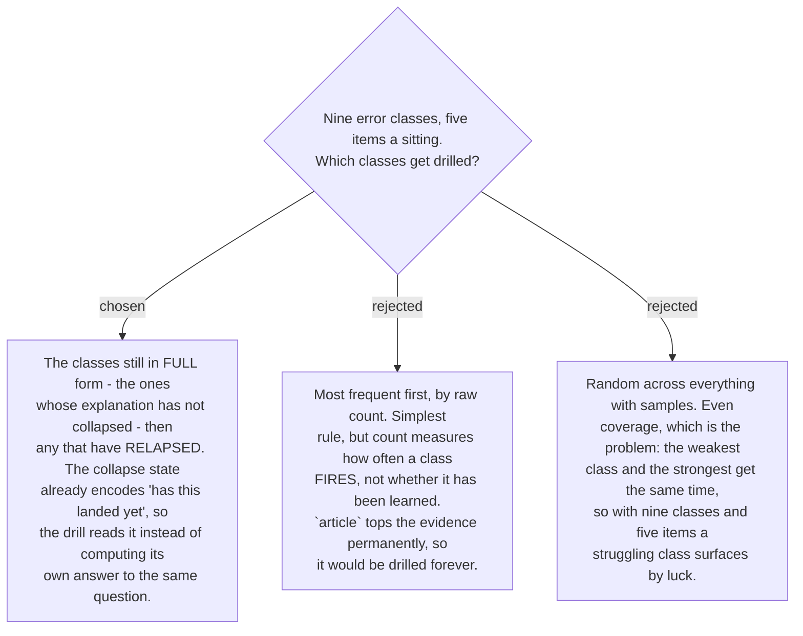

# Drill items are chosen by collapse state, not by frequency

[ADR 0184](workflow-daily-work-0184-a-class-explanation-collapses-after-n-and-returns-on-relapse.md)
already maintains a per-class judgement about whether a rule has landed: a class in **full**
form has not been absorbed yet, a **collapsed** one has, and a **relapsed** one was lost
again. That is precisely the question a drill selector needs answered, so it reads that
state rather than deriving a second, possibly disagreeing answer from the counts.

Frequency is the obvious alternative and the wrong measure. `article` is the top class in
every study surveyed on ticket #16 and will stay top of a raw count indefinitely — it fires
often *because Thai has no obligatory article*, not because the user has failed to learn it.
Ranking by count would drill it every sitting forever while a rarer, genuinely unlearned
class like `existential` never surfaced.

Two properties follow, and both are wanted:

- **It self-empties.** Once every class has collapsed and none has relapsed, there is
  nothing to drill. That is the correct outcome, not a gap — the drill has no work left,
  and saying so is more honest than manufacturing items.
- **Relapse pulls a class back in automatically.** No separate rule is needed for
  "something I used to know", because 0184 already restores the full form on relapse and
  this selector follows it.

Where a class in full form has no usable samples — the user deleted them, or the buffer was
cleared — fall back to the documented sentences from
[ADR 0199](workflow-daily-work-0199-an-empty-profile-falls-back-to-documented-errors-never-invented-ones.md)
for that class rather than skipping it.
