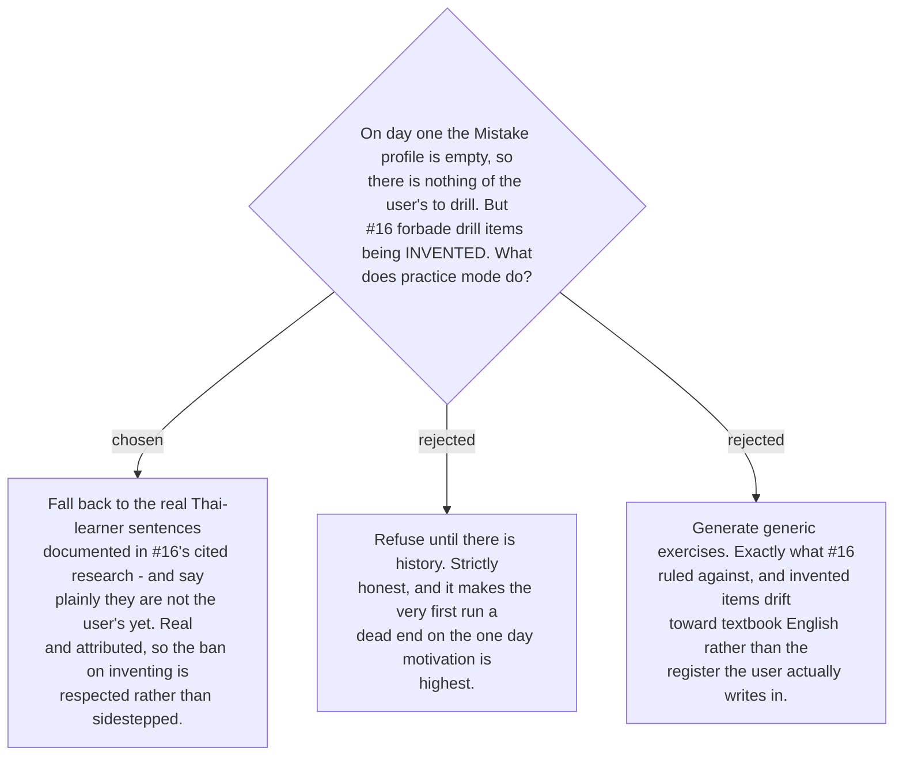

# An empty profile falls back to documented errors, never invented ones

Ticket #16 required that drill items be drawn from **recorded mistakes rather than
invented**. On an empty profile that requirement has nothing to draw on, and the tempting
reading — "then generate some" — is the one thing it explicitly forbade.

The rule it stated is narrower than it first appears, though. It forbade *inventing*; it did
not forbid *using documented ones*. #16's own research collected real sentences written by
real Thai learners, each attributed to a published source — *"I was like a dogs"*
(Suraprajit 2021), *"Have many trees in the university"* (Kaweera 2013), *"She like
gardening"* (Suraprajit 2021). These are evidence, not fabrication, and they exercise the
same nine classes.

So an empty profile drills those, and **says so**: these sentences are not yours yet. The
distinction matters because the whole claim of the drill is that it works on the user's own
errors, and quietly substituting someone else's would make that claim false.

The fallback **degrades correctly on its own**. As the user's samples accumulate, the
documented sentences are outranked and fall away with no rule to remove them. The same
fallback covers a narrower case:
[ADR 0198](workflow-daily-work-0198-drill-items-are-chosen-by-collapse-state-not-frequency.md)
uses it for a class that is in full form but has no usable samples.

Sentences used this way must carry their citation in the reference material, so that a later
reader can tell a documented error from an invented one — which is the only thing that keeps
this from collapsing back into option C.
