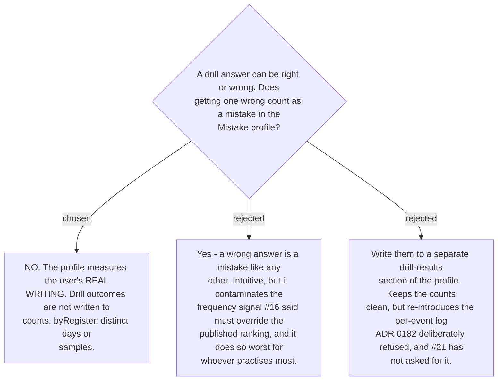

# Drill results do not write to the mistake profile

This was not asked on ticket #20 and has to be settled, because the drill and the profile
now touch.

The profile exists to answer one question: **what does this user get wrong when writing
English for real?** Ticket #16 rests the entire taxonomy on that measurement — observed
frequency overrides the published ranking, precisely because no study has sampled this
register. A drill is not that register. It is a deliberately weighted exercise, drawn by
[ADR 0198](workflow-daily-work-0198-drill-items-are-chosen-by-collapse-state-not-frequency.md)
from the classes the user has *not* yet learned.

Feeding drill outcomes back in would therefore corrupt the measurement in the most
misleading direction available: the classes deliberately over-sampled by the selector would
gain counts *because* they were selected, and the more diligently the user practised, the
more distorted their own profile would become. A skill that punishes practice by falsifying
the record of what it is for has inverted itself.

So a drill sitting changes **nothing** in the profile — not `count`, not `byRegister`, not
the distinct-day tally, not the samples. It is read-only against the store.

Two consequences, stated rather than discovered later:

- **Drill performance is not evidence of progress**, at least not through this route.
  `progress-signal` (#21) reads the profile, and the profile will not contain drill results.
  If that ticket wants them, it must decide where they live and defend it against the
  contamination argument above.
- **A class does not collapse or relapse because of drilling.** Collapse counts *exposure
  days on real cards*; a drill neither advances nor resets it. Practising cannot fast-track
  a class out of its full explanation, which is the conservative direction.
