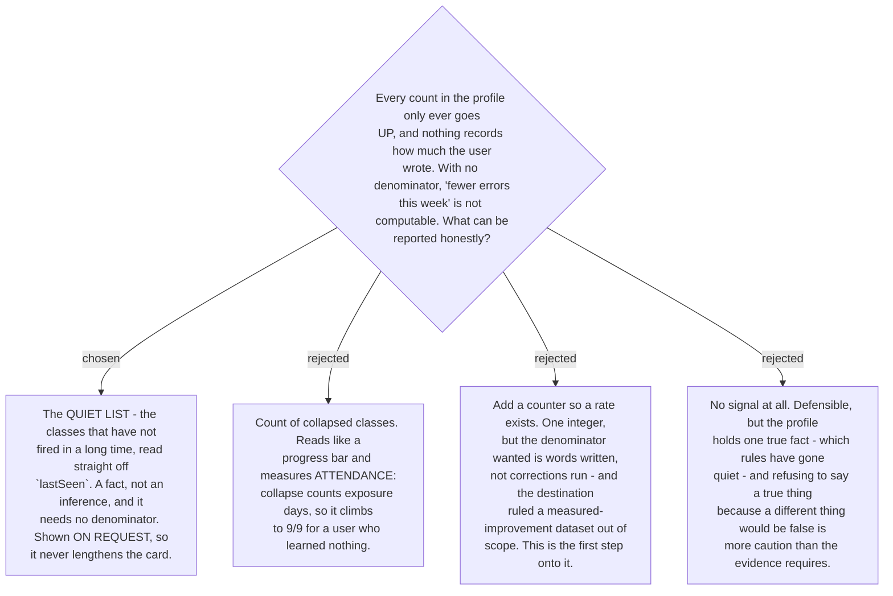

# The progress signal is the quiet list, shown on request

The profile cannot answer the question it is most often asked. `count`, `distinctDays` and
every `byRegister` figure are **cumulative** — they only rise. And nothing anywhere records
how much English the user wrote, so there is no denominator: a falling weekly count is
indistinguishable from writing less, writing shorter messages, or writing in Thai instead.

One thing in the store *can* fall, and it is the useful one. **`lastSeen` goes stale.** A
class that has not fired in three weeks is a fact — a date, not a division — and it happens
to be the more useful half of what a person wants to know. "Which rules have gone quiet"
locates where you stand better than any total does.

So the signal is a **quiet list**: the classes not seen in a long time, each with how long,
and beside them the classes still firing. Both halves matter; a list of only successes is a
different and worse artefact.

**Shown on request only.** [ADR 0179](workflow-daily-work-0179-the-correction-card-is-lesson-first-and-explains-every-change.md)
chose the lesson-first card and two ADRs since have fought to keep it short. A progress
block on every correction would push the lesson down for something the user did not ask for,
and progress is not a thing anyone needs reported five times a day.

The collapsed-class count was the tempting headline and is the trap: **collapse counts
exposure days, not correctness**. A class collapses because its explanation was shown ten
times, so that number climbs steadily whether or not anything was learned, and reaches 9/9
for a user who never improved.

**How long is "a long time"? The relapse gap, and no new number.**
[ADR 0184](workflow-daily-work-0184-a-class-explanation-collapses-after-n-and-returns-on-relapse.md)
already defines quiet: a class relapses when it fires again after **14 quiet days**, so this
system already holds an opinion about how long silence must last before it means something.
The quiet list uses that same threshold rather than inventing a fourth guessed number.

This keeps the two halves consistent by construction. A class crossing into the quiet list is
exactly a class that would count as a **relapse** if it fired tomorrow — the same fact
reported forward instead of backward. Had the thresholds differed, the skill could have
called a class quiet and then declined to treat its return as a relapse, or the reverse, and
nothing would have flagged the contradiction.

If the relapse gap is ever tuned, the quiet list moves with it. That is intended.
