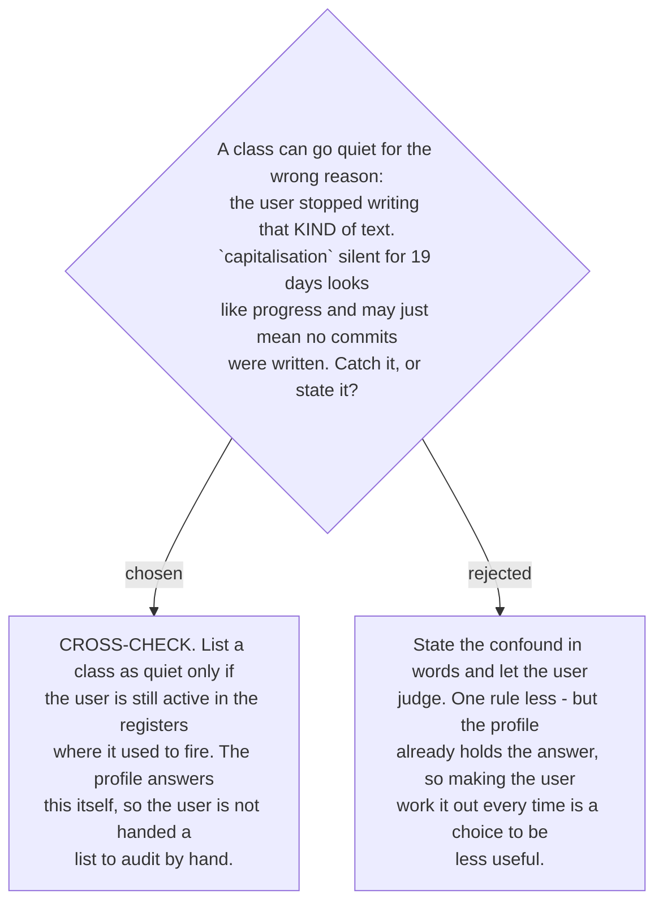

# The quiet list is cross-checked against register activity

The strongest objection to a quiet list is that silence has two causes. `existential` may
have gone quiet because the rule landed, or because the user stopped writing the bug reports
where `มี` used to trip them. Reported without that check, the list flatters.

So a class is listed as quiet only when the user is **still writing in the registers where
it used to fire** — `byRegister` already records which registers those were.

**This needs one field the schema does not have, and it must measure the right thing.**
`byRegister` holds cumulative *counts*, not dates, so it cannot say whether the user is still
writing commits. The obvious fix — take the newest `lastSeen` among classes that ever fired
in that register — is **wrong in the worst possible direction**: a user who writes commits
*perfectly* produces no errors, so no `lastSeen` advances, and the register looks abandoned.
That would hide exactly the improvement the signal exists to find.

The field therefore records **activity, not errors**: the profile gains a top-level
`registers` map holding, per register, the date a correction was last **run** in it —
whether or not it found anything. That is the minimum that makes the cross-check sound, and
it is deliberately **only a date**. A per-register *count* would be the denominator
[ADR 0201](workflow-daily-work-0201-the-progress-signal-is-the-quiet-list-shown-on-request.md)
declined to add, and the destination ruled out.

**Amends [ADR 0182](workflow-daily-work-0182-the-profile-holds-counts-and-a-capped-sample-not-a-log.md)**,
which describes the per-class record and no profile-level state. Ticket #19 carries a
comment. This is the second such extension — ADR 0185 added the distinct-day tally — and
both were found the same way: by a later ticket asking the store a question it could not
answer.
