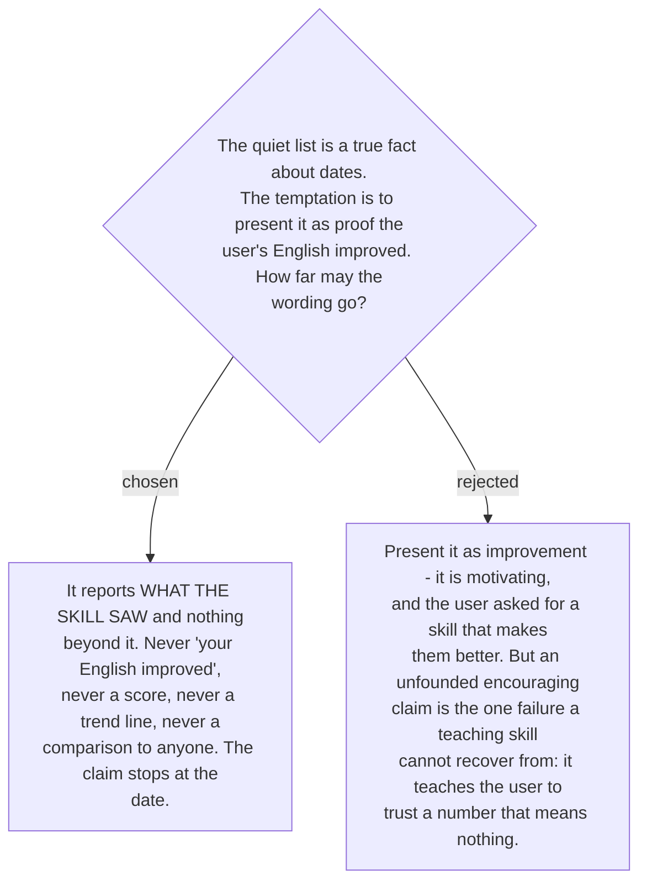

# What the progress signal must not claim

This ADR exists because ticket #21 asked the question explicitly, and because the honest
answer is a list of refusals that would otherwise never be written down.

The quiet list is true and narrow. It says: *this class has not been corrected in your
writing for N days, and you are still writing the kind of text where it used to appear.*
Everything past that sentence is unsupported by anything the profile holds.

**The signal must never:**

- **Claim the user's English improved.** It observed corrections, not English. Text that was
  never run through the skill is invisible to it, and that is most of what anyone writes.
- **Report a score, grade, level, streak or percentage.** Each implies a denominator that
  does not exist.
- **Draw a trend.** The store is an aggregate with a capped sample, not a history — ADR 0182
  refused a per-event log deliberately, so there is nothing to plot.
- **Use drill results as evidence.** [ADR 0200](workflow-daily-work-0200-drill-results-do-not-write-to-the-mistake-profile.md)
  keeps them out of the profile, and that decision is not to be worked around here by
  reading them from the session instead.
- **Compare the user to anyone** — other users, learners in the studies, a target level.
- **Congratulate on a collapse.** Collapse counts exposure days, so it marks attendance, not
  learning.

**And it must say what it is.** The quiet list carries a plain line naming its own limit:
these are corrections this skill made, not a measurement of English. Ticket #16 recorded a
counter-signal against treating any of this as settled, and the destination explicitly put a
measured-improvement dataset out of scope. Both point the same way — the number of things
this skill can honestly claim about the user's progress is small, and saying so is part of
the signal rather than a disclaimer attached to it.
