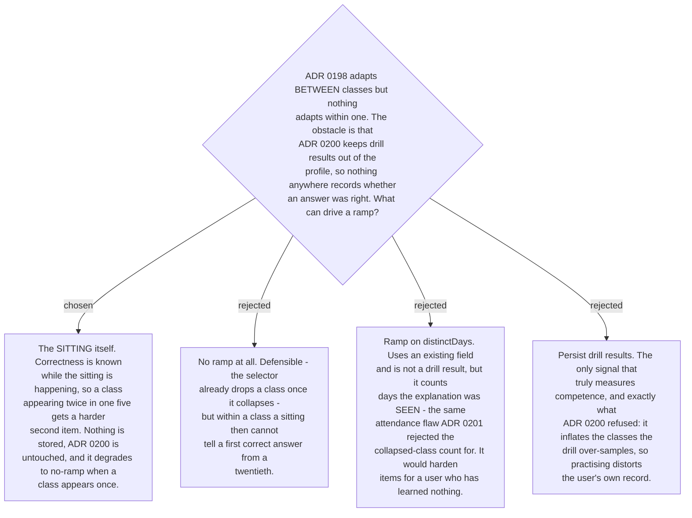

# Difficulty ramps within one sitting, and nowhere else

Ticket #30 named the obstacle precisely: difficulty wants a competence signal, and
[ADR 0200](workflow-daily-work-0200-drill-results-do-not-write-to-the-mistake-profile.md)
deliberately left none in the store.

`distinctDays` was the obvious substitute and had to be rejected on the reasoning
[ADR 0201](workflow-daily-work-0201-the-progress-signal-is-the-quiet-list-shown-on-request.md)
already established: it counts days on which the explanation was **seen**, which is
attendance, not competence. Ramping on it would hand harder items to the user who has
learned least, purely because time passed — the opposite of what a ramp is for.

But there is one place correctness genuinely is known, and it needed no storage to find:
**inside the sitting**. The user just answered. So when a class appears more than once in a
sitting — common, since
[ADR 0198](workflow-daily-work-0198-drill-items-are-chosen-by-collapse-state-not-frequency.md)
concentrates selection on the few classes still in full form — a **correct** answer makes the
next item of that class harder, and a **wrong** answer steps it back down. Every sitting
starts each class at the easiest level, because nothing persists.

This is strictly better than no ramp rather than a different trade: where a class appears
once, the behaviour is identical to having no ramp at all.

**Nothing is written.** The state lives in the sitting, in the conversation, and dies with
it. There is no per-event log to migrate, nothing to contaminate the frequency signal #16
depends on, and no second store to keep in agreement with the profile.

The honest limit: **a ramp that resets every sitting cannot recognise long-run mastery.** It
is not trying to. Long-run mastery is already handled one level up — a class that lands stops
being selected at all once it collapses, which removes it from the drill entirely.
