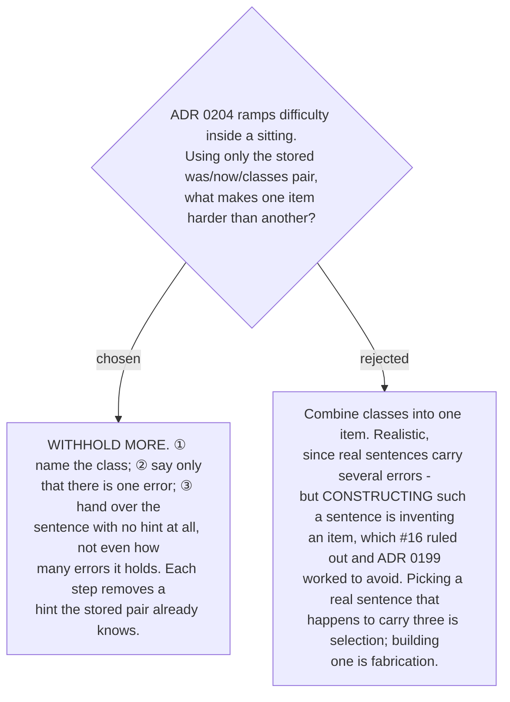

# Harder means withholding more — named, unnamed, open

The ladder is built entirely from what
[ADR 0182](workflow-daily-work-0182-the-profile-holds-counts-and-a-capped-sample-not-a-log.md)
already stores — the wrong sentence, the right sentence, and which classes were involved:

1. **Named** — *"there is an `article` error here; fix it."* The user knows what to look for
   and only has to produce the correction.
2. **Unnamed** — *"there is one error here; find it and fix it."* Locating the error is now
   part of the task.
3. **Open** — the sentence, and nothing else. Not even how many errors it holds.

Each step removes a hint rather than adding content, which is what keeps it honest: no item
at any level contains a word the profile did not already record. That distinction is what
separates this from the rejected alternative. Selecting a real sentence that happens to carry
three classes is selection; stitching one together to carry three is fabrication, and ticket
#16 ruled item invention out.

The ladder also happens to run in the right pedagogical direction. Level 1 tests production
alone. Level 2 adds detection — noticing something is wrong, which is the harder half for a
writer whose L1 does not mark the feature at all. Level 3 is the real task: reading your own
sentence with no one telling you anything is in it.

Grading is unchanged across the three levels — the answer is compared against the correction
already made. How to grade an answer that differs from that correction but is also correct
English remains open, and is recorded as fog on the map.

**Amended 2026-09-07, during the build (ticket #23).** The ladder above describes `named` as
naming *the* class and `unnamed` as saying there is *one* error. Tracing a sitting by hand
showed both are wrong whenever a sample carries **two** classes, which is common — *"when user
not login yet"* holds an `article` and a `copula` error.

An item selected for `article` grades **both** classes, because
[ADR 0207](workflow-daily-work-0207-the-drill-verdict-is-per-error-class-not-per-item.md)
grades every class in the stored pair. So naming one and grading two marks the user wrong on
something the level explicitly promised to tell them.

Corrected: **`named` names every class in the item**, and **`unnamed` gives the count** rather
than asserting there is one. `open` is unchanged — it says nothing, which was already right.
The ladder still only ever *removes* information; it now removes the right amount at each
step.
