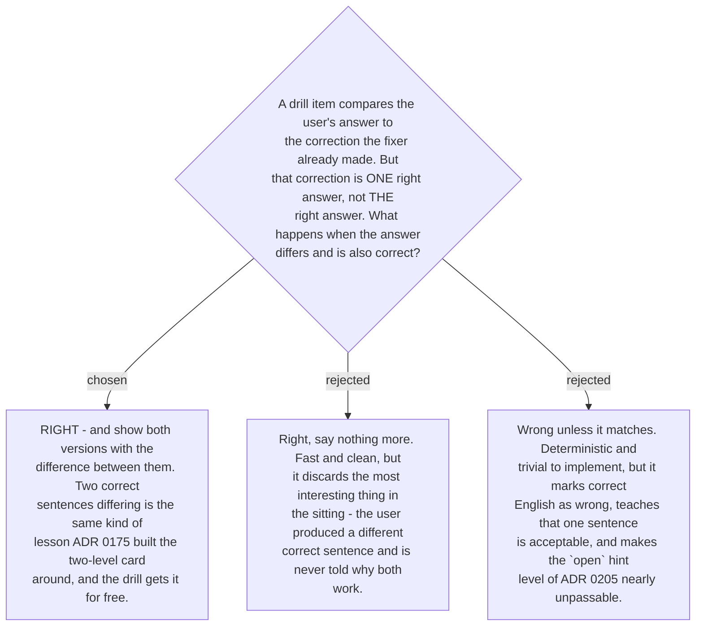

# A divergent but correct answer is right, and the difference is shown

The stored correction is a **sample of the right answer, not its definition**. *"when the
user is not logged in yet"* and *"when a user has not logged in"* both repair the same
`article` and `copula` errors, and a grader that accepts only the first is not grading
English — it is grading recall of a specific string.

So an answer is judged on whether it **fixes the targeted error classes and is correct
English**, not on whether it matches. Matching is one way to pass, not the test.

**And the divergence is shown, not passed over.** This is the same argument that produced
the two-level card: [ADR 0175](workflow-daily-work-0175-the-rewrite-returns-two-levels-a-minimal-fix-and-a-natural-version.md)
returns a minimal fix *and* a natural version specifically because the **gap between two
valid renderings is where the L1 shape difference lives** — the part no error label can
name. A drill answer that diverges and works has produced exactly that gap, from the user's
own hand rather than the skill's. Discarding it would throw away the best teaching moment
the drill can generate, and one it did not have to construct.

The difference is shown as a difference, not as a correction: both sentences stand, with a
short note on what separates them — *`a user` is anyone, `the user` is one we already
mentioned; `has not logged in` is the action, `is not logged in` is the state.* Nothing is
marked wrong.

Grading this way needs judgement rather than comparison, and that judgement is the model's.
That is acceptable here in a way it would not be in the fixer: a misjudged drill costs one
item in a five-item sitting and nothing is written down —
[ADR 0200](workflow-daily-work-0200-drill-results-do-not-write-to-the-mistake-profile.md)
keeps drill outcomes out of the profile entirely, so a wrong verdict cannot corrupt any
record.
