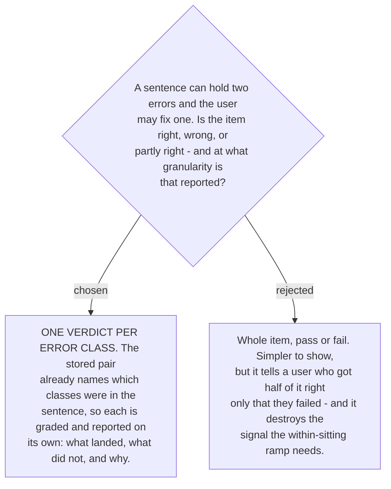

# The drill verdict is per error class, not per item

The unit was already decided; this ADR only declines to throw it away. Every stored sample
carries the classes that were repaired in it, and the whole taxonomy exists so that a
correction can say *which rule* was broken. Collapsing that back to one pass/fail at the
moment of grading discards the structure everything else is built on.

Grading per class also answers the question that hint level `open`
([ADR 0205](workflow-daily-work-0205-harder-means-withholding-more-named-unnamed-open.md))
makes acute. At that level the user is not told what to look for or how many errors there
are, so "wrong" is an unhelpful verdict — *which* one did they miss is the entire content of
the feedback.

**It is also what makes the ramp precise.**
[ADR 0204](workflow-daily-work-0204-difficulty-ramps-within-one-sitting-and-nowhere-else.md)
raises the hint level for a class after a correct answer and lowers it after a wrong one. With
a per-item verdict, an answer that fixed `article` and missed `copula` would have to move both
in the same direction, which is wrong in both cases. Per-class verdicts move each one on its
own evidence. That is a clarification of 0204 rather than a change to it — 0204 already spoke
in terms of "the next item of that class".

A per-class verdict carries the class's own explanation with it where the class was missed,
drawn from `references/english-error-explanations.md` like everywhere else, subject to the
same short-form rules. A class the user got right needs no explanation repeated at them.
