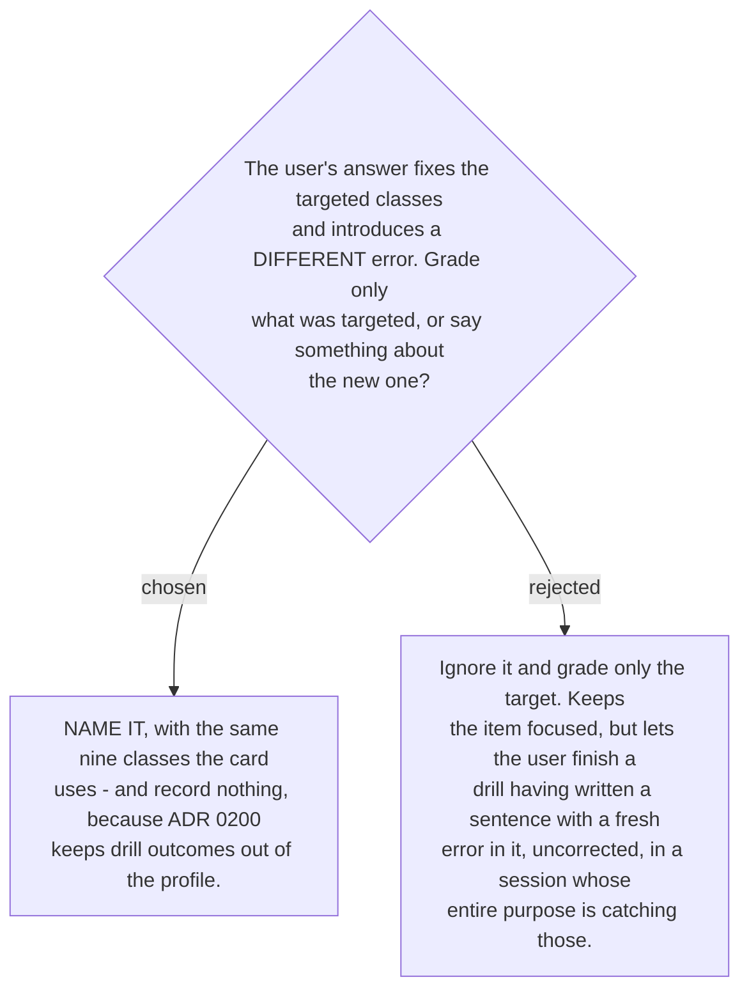

# A new error in a drill answer is named, and recorded nowhere

A drill answer is a sentence the user wrote. Letting a fresh error pass unremarked inside the
one activity built to catch errors would be a strange thing for this skill to do — and it is
the same failure mode
[ADR 0192](workflow-daily-work-0192-a-register-correction-re-runs-rather-than-relabels.md)
rejected in the fixer, where a correct header sat above uncorrected content.

So a new error is named using the same nine classes, in the same words, from the same
reference file. There is no separate vocabulary for mistakes made during practice.

**It changes no verdict.** The targeted classes are graded on their own merits
([ADR 0207](workflow-daily-work-0207-the-drill-verdict-is-per-error-class-not-per-item.md));
a new error is reported beside them, not subtracted from them. Fixing what you were asked to
fix is a pass even if the sentence acquired a different flaw on the way, and conflating the
two would make the ramp respond to the wrong evidence.

**And it is recorded nowhere.**
[ADR 0200](workflow-daily-work-0200-drill-results-do-not-write-to-the-mistake-profile.md)
keeps drill outcomes out of the profile, and an error made in a drill is a drill outcome. It
is especially important here: drill sentences are produced under artificial constraint, on
items deliberately drawn from the classes the user has *not* learned, so counting errors made
in them would distort the profile in precisely the direction 0200 was written to prevent.
