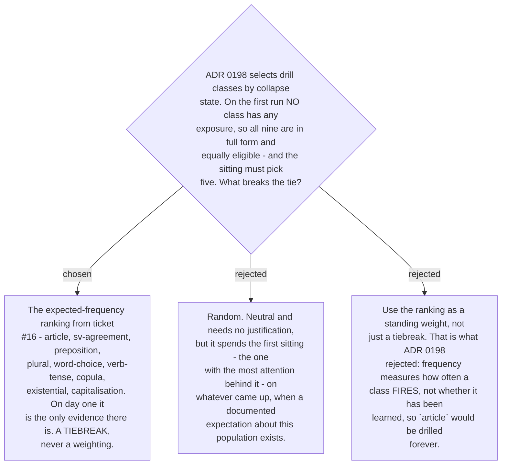

# Equally eligible drill classes are ordered by the research ranking

Found by tracing a first sitting by hand during the build of ticket #23. Selecting by collapse
state, as [ADR 0198](workflow-daily-work-0198-drill-items-are-chosen-by-collapse-state-not-frequency.md)
requires, does not discriminate when every class has the *same* state — and on the first run
every class has zero exposure days, so all nine are in full form at once. Eight of them have a
documented seed and the sitting needs five. Nothing said which five.

The ranking from ticket #16 fills the gap with the only evidence available at that moment. It
is an expected-frequency order for Thai-L1 writers, derived from the cited literature, and on
day one there is no user-specific data to prefer over it.

**It is a tiebreak and must stay one.** ADR 0198 rejected frequency as a *selector* for a
reason that has not changed: frequency measures how often a class fires, not whether it has
been learned, so ranking by it would drill `article` forever. The moment two classes differ in
collapse state, that difference decides and the ranking is not consulted. It is consulted only
between classes the collapse state cannot separate.

The ranking's own weakness is worth restating, since this is the one place it is load-bearing:
#16 recorded it as **low-confidence**, reasoning over a register nobody has studied, and noted
that genre can invert rank within a single cohort. That is acceptable here precisely because
it only ever chooses between options already judged equal, and because it is displaced by real
data as soon as any exists.
