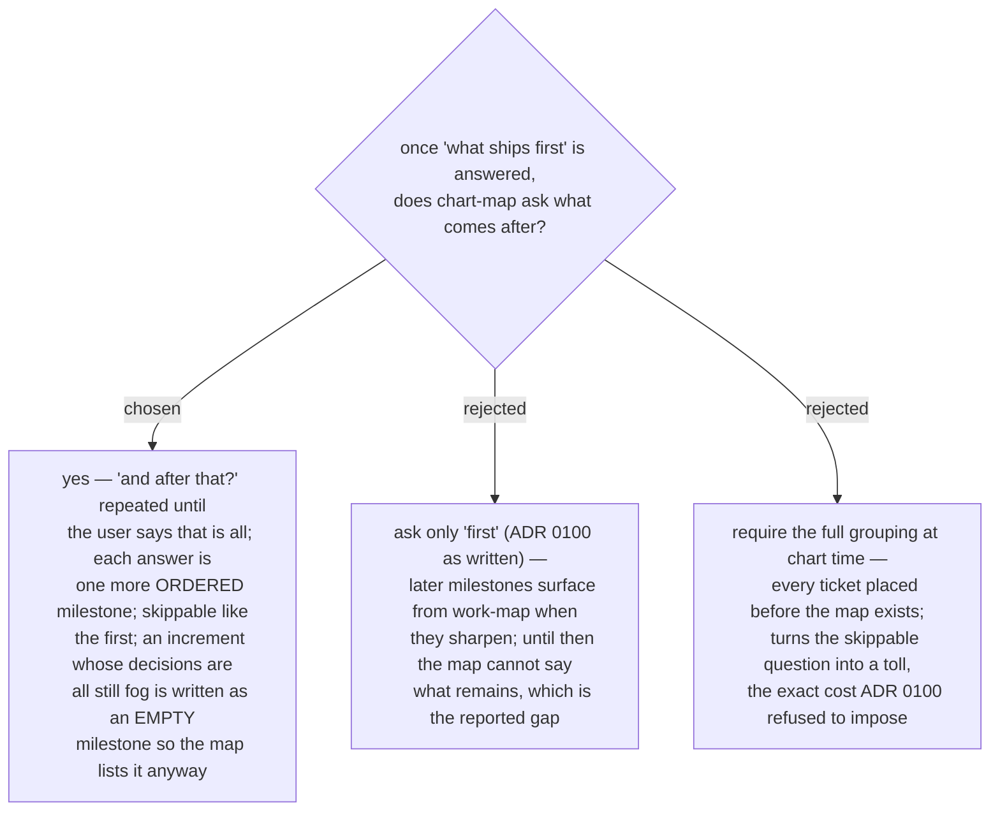

# chart-map asks for the later milestones too, one skippable question at a time

ADR 0100's single closing question records exactly one milestone, so a freshly
charted map names what ships first and nothing about what ships after: every other
ticket sits unassigned, and a reader opening `map.md` cold cannot tell that later
increments exist, let alone which of them remain (reported 2026-09-13). The closing
question therefore becomes a short loop — "what do you want to demo first?", then
"and after that?" until the user says that is all — with each answer appended as the
next ordered entry of the same `milestones` input, through the same dry-run gate.
Every question stays skippable and declining costs nothing: work-map still grows the
list later (ADR 0098). Members are the tickets already named on this pass; an
increment whose decisions are all still fog is written as an empty milestone (`[]` —
legal, and never `complete`, per the contract), so the Milestones region carries the
whole plan, in order, from day one. Refines ADR 0100; its two entry moments, the
skippability and work-map's once-per-session offer stand unchanged.
