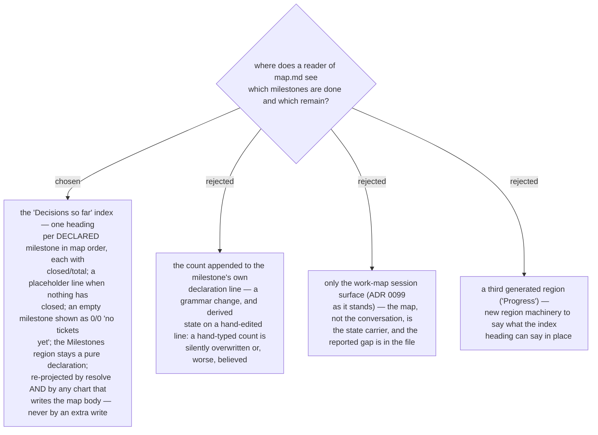

# The decisions index shows every declared milestone with its progress, re-projected by every write that touches the map body

ADR 0103 grouped the index by milestone but omitted any milestone with no closed
decision, and ADR 0099 put progress only in `frontier.json`, so `map.md` — the one
artifact a cold reader opens — never says which milestone is complete and which
remain (reported 2026-09-13, together with ADR 0210). The index therefore becomes the
map's status board: every declared milestone renders as a heading carrying
`<closed>/<total> closed`, in map order, its key-ascending entries beneath, a
placeholder line when nothing has closed yet, and an empty milestone as `0/0` with
"no tickets yet"; the `(unassigned)` tail stays. The counts are the ones
`milestone_progress` already computes — distinct members, closed ones included — so
the file and `frontier.json` cannot disagree. The Milestones region stays a pure
declaration. The index is re-projected by `resolve` as before **and** by any `chart`
that writes the map body (a chart that adds or extends a milestone always does), never
by a write that would not otherwise happen — so the GitHub call budget is unchanged
and identical input over unchanged ticket state stays byte-identical. The JSON shapes
of `map.json` and `frontier.json` do not change. Refines ADR 0103.
