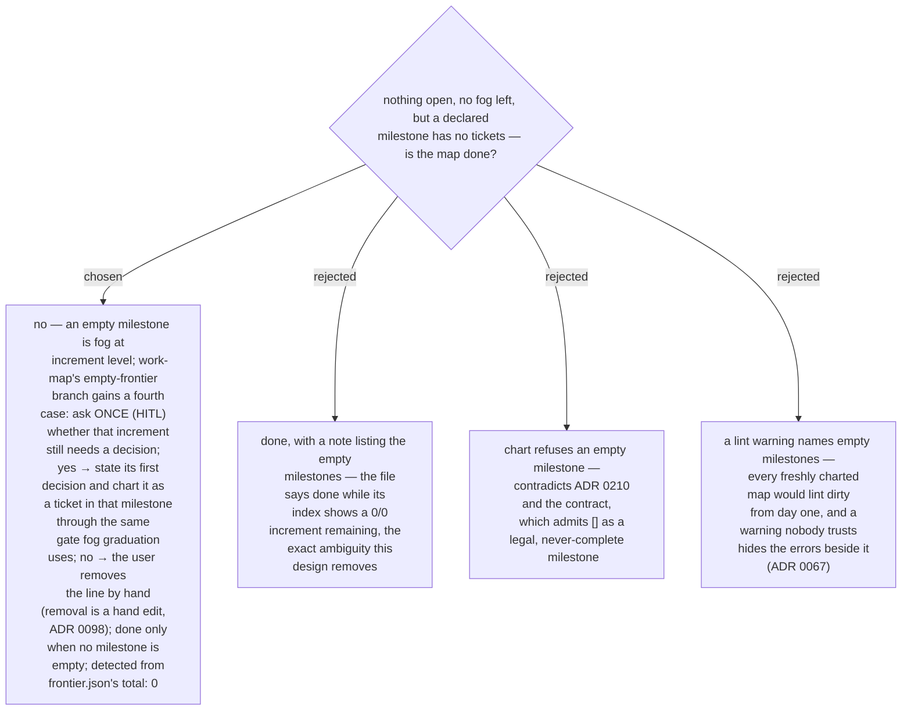

# An empty milestone holds the map open like fog does: work-map asks whether it still needs a decision before declaring the map done

With ADR 0210 a freshly charted map may carry milestones that hold no ticket yet.
`milestone_progress` already refuses to call such a milestone complete, but
work-map's "nothing open and no fog left — the map is done" never looked at
milestones, so the map would be declared done while its index still showed a `0/0`
increment, and a reader could not tell "needs no decision" from "forgotten". An
empty milestone therefore means what fog means — an increment we know exists whose
decisions are not yet stated — and holds the map open the same way. When the
frontier is empty and no fog remains but `frontier.json` lists a milestone with
`total: 0`, work-map asks one HITL question per such milestone, in map order: does
this increment still need a decision? **Yes**: the session's work is graduation —
state that first decision and chart it as a ticket in that milestone, through the
same dry-run gate fog graduation uses. **No**: the user removes the line by hand,
the same hand edit every other removal is (ADR 0098), optionally leaving a note line
saying why; `lint` guards the region afterwards. The map is done only when no
milestone is empty. The session surface (ADR 0099) reads such a milestone as
`0/0 — no tickets named yet` and never recommends into it, since it has nothing
takeable; no lint rule is added, because the frontier document already carries the
fact and a warning that fires on every new map would be noise.
