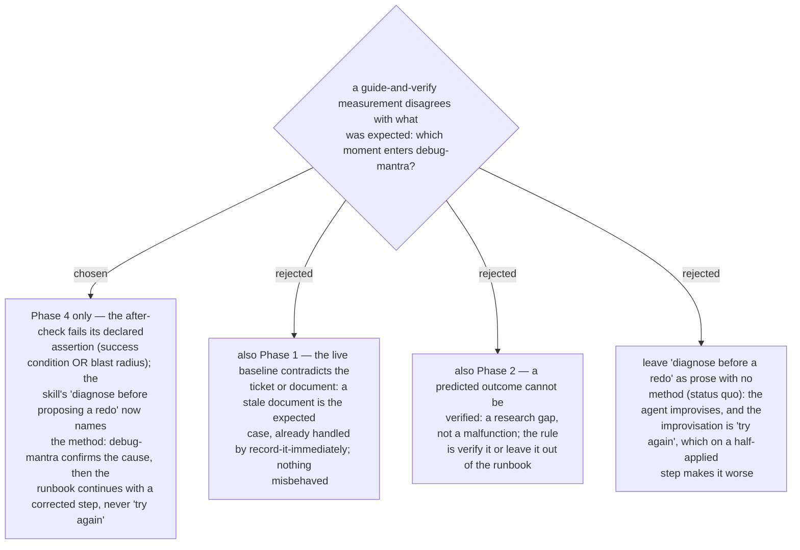

# guide-and-verify hands a failed after-check to debug-mantra, and only that moment

`guide-and-verify` Phase 4 already says *"if the check fails, say so plainly with the
numbers, and diagnose before proposing a redo"* — but names no method, so the agent
improvises, and the improvisation is "try again" on a step that may have half-landed.
Ruled 2026-09-14: a failed after-check is the one moment in the skill where something
*misbehaved* and the person is about to act on a guess, so it hands off to `debug-mantra`
exactly as `grill-then-plan` does under ADR 0011, with the same invariant — *never propose a
redo on an unverified cause*. The other two moments where a measurement disagrees with a
document are not malfunctions: a Phase 1 baseline that contradicts the ticket is the expected
case and is handled by writing it down immediately, and a Phase 2 prediction with no evidence is
a research gap whose rule is already "verify it or leave it out". Following ADR 0011's shape,
the change lands in the caller (`guide-and-verify`); `debug-mantra` is not edited.
