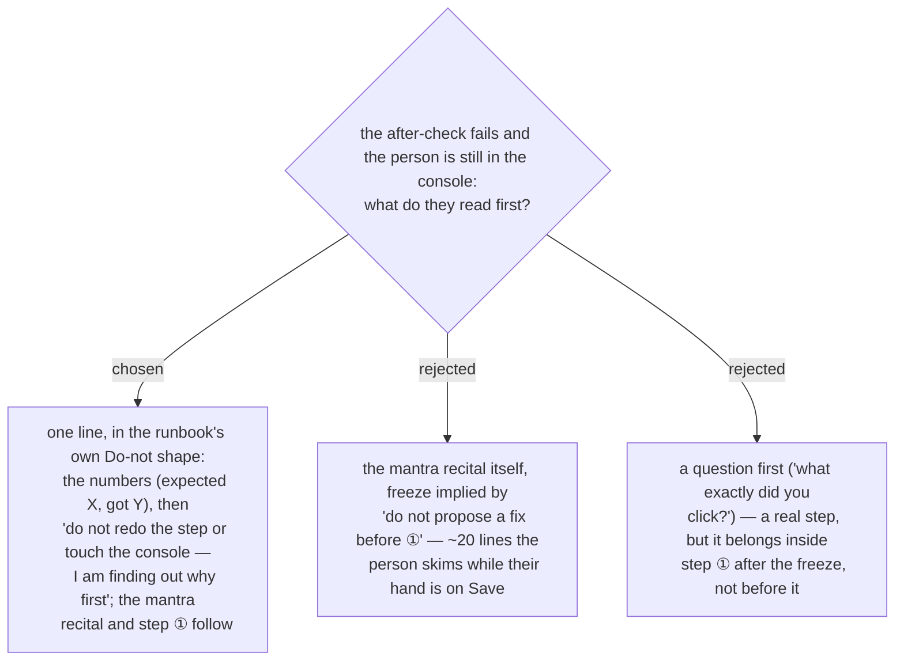

# A failed after-check opens with a one-line freeze before the mantra recital

At the ADR 0214 handoff the person is sitting in the console with the object open, and the
natural reaction to "check failed" is to click Save again — which destroys the half-applied
state, the one breadcrumb that tells *not saved* from *not applied* from *wrong object*.
Ruled 2026-09-14: the first line of the handoff is a freeze, before `debug-mantra`'s recital.
It carries the measured numbers and the prohibition with its reason, in the same
`Do not … — because …` shape the person has been reading all session, so it lands in the
seconds before they act. The recital stays verbatim and follows immediately; the freeze is
`guide-and-verify`'s line, not a change to the mantra.
