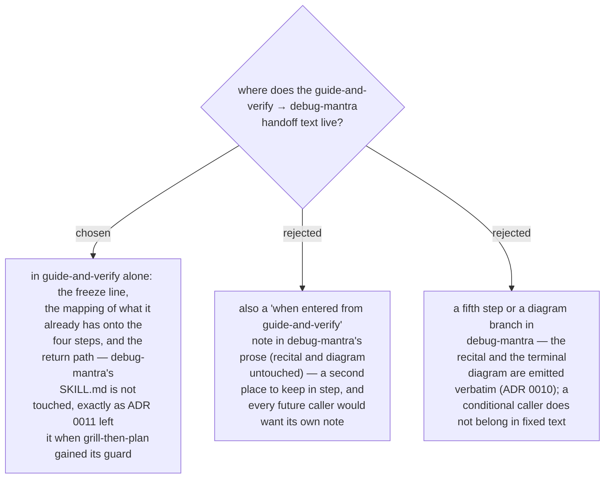

# The handoff lives in guide-and-verify only — debug-mantra is not edited

Ruled by the owner 2026-09-14: *we will not modify debug-mantra.* `debug-mantra` is the
callee; every caller that hands off to it — `grill-then-plan` under ADR 0011, now
`guide-and-verify` under ADR 0214 — carries its own entry conditions in its own SKILL.md, and
says there what it already has for each of the four steps so the callee is not asked for a
repro it was just given. The mantra and the process diagram stay fixed text, and the prose
around them stays caller-agnostic; the alternative is one note per caller in a file whose
whole value is that it reads the same in every session.
