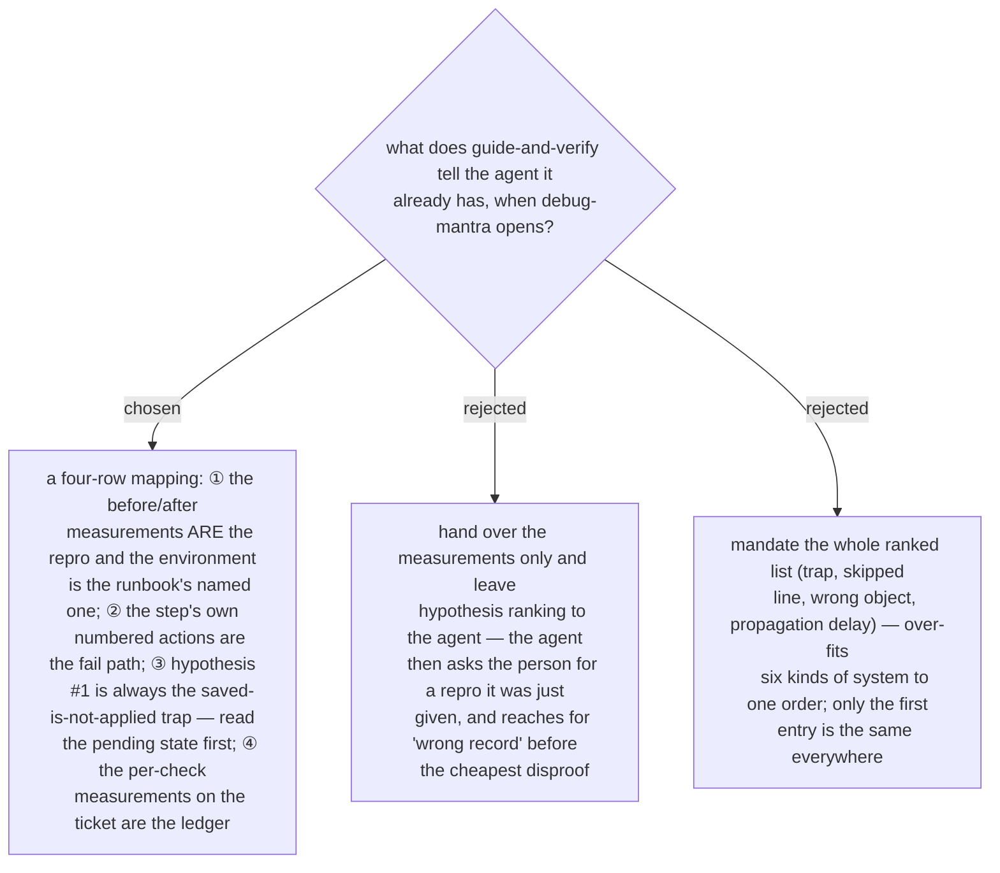

# The handoff maps what it already holds onto the four steps, and ranks saved-is-not-applied first

`debug-mantra` step ① stops when there is no repro and asks the user for one; entered from a
failed after-check, the repro already exists — the baseline and the after-measurement, taken
read-only in a second channel — and the environment is the one the runbook names. Ruled
2026-09-14: `guide-and-verify`'s handoff text says this mapping out loud so the agent does not
re-ask for what it holds, and it fixes exactly one hypothesis: **#1 is the saved-is-not-applied
trap**, because the skill already carries its six-system table, it explains most failed checks,
and its disproof is one read of the pending state. Everything after #1 stays the agent's to
rank, per the mantra's own step ③.
