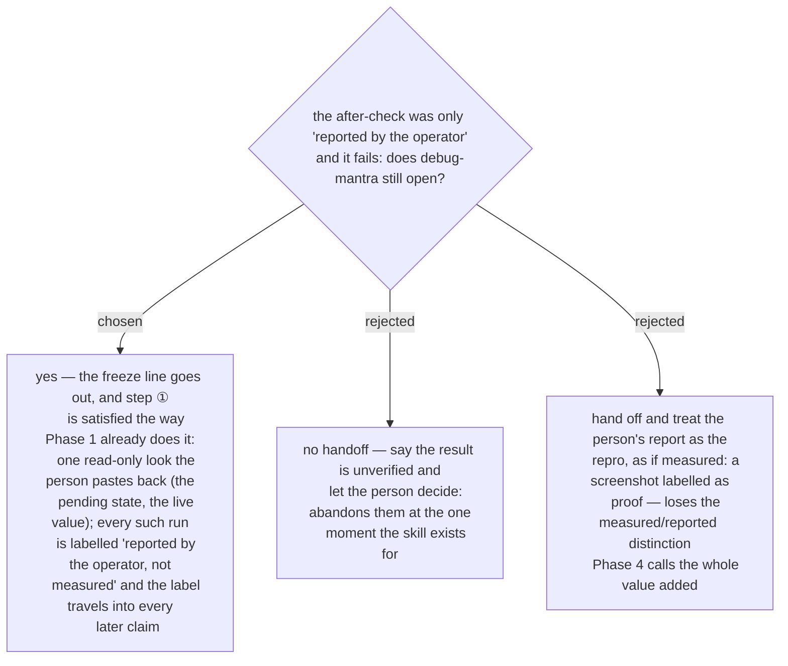

# With no second channel the handoff still fires, and step ① borrows the person's eyes

Phase 4 already names the systems with no second channel — consumer-grade admin pages,
routers, many SaaS settings screens — and rules that a check there is *"reported by the
operator, not independently measured"*, never *verified*. When such a check fails, there is no
measured repro for `debug-mantra` step ① to start from, only the person's words. Ruled
2026-09-14: the ADR 0214 handoff fires anyway; the ADR 0215 freeze goes out; and step ① is
met by the move Phase 1 already teaches when the agent cannot read the system — **borrow the
person's eyes**: one read-only look, pasted back, which becomes the run. The ledger entry for
that run carries the *reported by the operator* label, and so does every conclusion built on
it. The skill learns no new move; it applies an existing one at a second moment.
