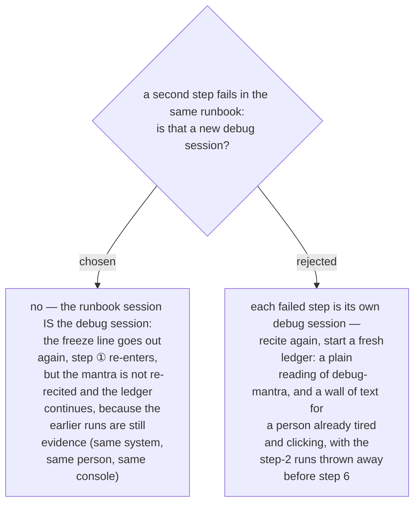

# The runbook session is one debug session — recite once, keep one ledger

`debug-mantra` recites the mantra and the diagram *once per debug session, in the first
response*, and does not define a session when a runbook surrounds it. Ruled 2026-09-14, on the
caller's side only (ADR 0216): the whole `guide-and-verify` runbook session is one debug
session. The first failed after-check gets the ADR 0215 freeze and the full recital; every
later failed step in the same runbook gets the freeze and re-enters at step ① with the ledger
it already has — no second recital, no fresh ledger. The runs from an earlier failed step stay
evidence for a later one because the system, the person and the console are the same, which
is exactly what step ④ cross-references. Nothing in `debug-mantra` changes; this is the
caller's reading of the word *session*.
