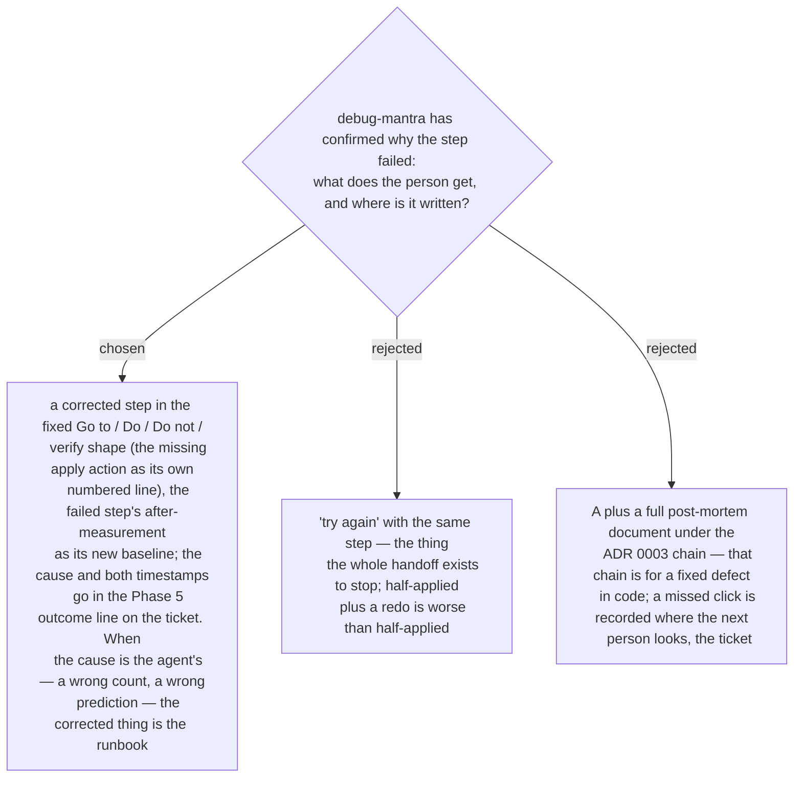

# A confirmed cause returns as a corrected step, recorded on the ticket — not a redo, not a post-mortem

Ruled 2026-09-14: when `debug-mantra` returns a confirmed cause, `guide-and-verify` resumes
at Phase 3 and writes a **corrected step** in the shape the person has been reading all
session — never "try again". The after-measurement of the failed step is the baseline the
corrected step is asserted against, so Phase 4 runs on it like any other step. The cause, the
time the step failed and the time the corrected step landed go into the Phase 5 outcome line
on the ticket, beside the measurement, because that is where the next person looks. When the
cause is on the agent's side — a Phase 1 count that was wrong, a Phase 2 prediction that was
wrong — the corrected thing is the runbook itself, and the person is told so. The ADR 0003
chain (fix → post-mortem → management-talk) is not entered for a missed click; it applies only
when the confirmed cause is a real defect in the system, and that is a hand-off *out of* the
runbook which the skill names as such.
