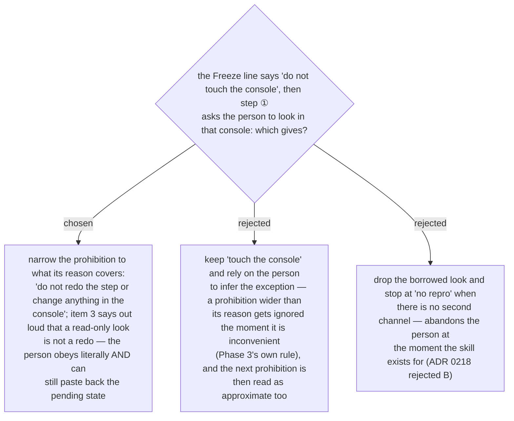

# The Freeze line forbids changes in the console, not looks — a read-only look is not a redo

Found at the whole-branch review, 2026-09-14: the ADR 0215 Freeze line forbade touching the
console, and two paragraphs later the ADR 0218 path asked the person to look in it — the
pending-state read that disproves hypothesis #1 (ADR 0217) is, in a portal, a read only they can
perform. Ruled by the controller as ADR 0092 requires of a mid-run ruling: the prohibition is
narrowed to *change anything in the console*, which is exactly what its reason covers — a redo
destroys the half-applied state, a look does not — and item 3 states the exception explicitly
so the person never has to infer that this agent's prohibitions are approximate. ADR 0215's
decision stands; only the quoted line's verb changes, and 0215 carries the refinement note.
