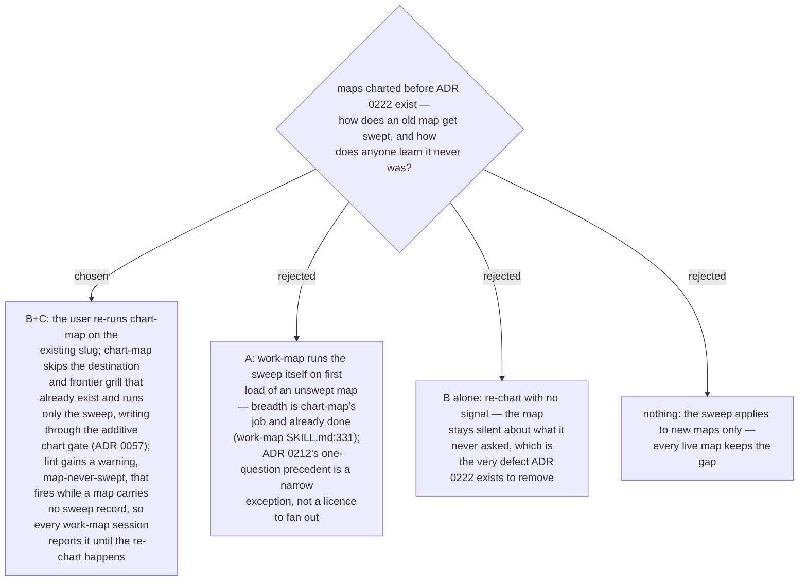

# Maps charted before the sweep are swept by an additive re-chart, and lint flags a map that carries no sweep record

The sweep of ADR 0222 lands in chart-map, but the maps that motivated it were
charted before it existed and will be worked for many more sessions. Breadth stays
chart-map's responsibility, so an old map is swept by running chart-map again on
the existing map: `chart` is additive (ADR 0057), so the run adds only what the
sweep finds — new tickets, fog lines, out-of-scope lines and the none records —
and touches nothing already there. What makes anyone do that is `lint`: a
`map-never-swept` warning fires while the map carries no sweep record, and work-map
already reports lint findings at load and at stop, so the gap is visible every
session until it is closed. ADR 0212 rejected a lint rule for empty milestones
because every fresh map would lint dirty; this rule does not have that property —
a map charted after ADR 0222 carries its sweep record from the first `--real`, so
only pre-sweep maps fire. Known cost: a pre-sweep map whose work is all closed also
fires; whether the rule is narrowed to maps with open work is left to the record's
shape decision, since the rule can only be as precise as the record it reads.
