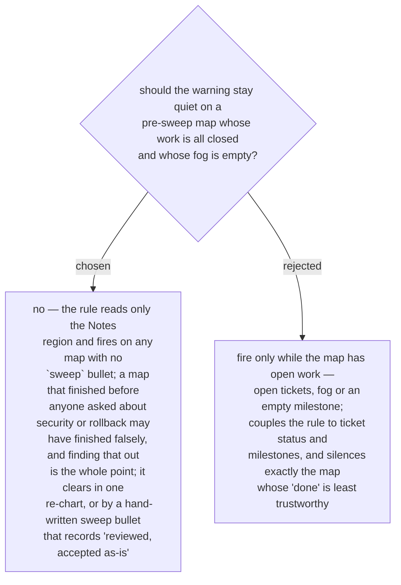

# `map-never-swept` fires on every map without a sweep record, finished or not

ADR 0223 left open whether the rule should be narrowed to maps with open work,
because the record could not be read until ADR 0224 fixed its shape. It is not
narrowed. The rule reads the Notes region alone and fires on any map that carries
no `sweep` bullet, whether or not its tickets are all closed and its fog empty. A
pre-sweep map that was declared done without ever being asked about an area is the
map most worth flagging, not least; narrowing would hide it. The cost is one
warning per finished pre-sweep map until it is swept, and the cure is cheap: a
re-chart whose every area comes back none writes the record and clears the
finding, and an owner who has already reviewed a finished map may write the sweep
bullet by hand — `sweep <date>: reviewed, accepted as-is` — which is a legitimate
record, not a workaround.
