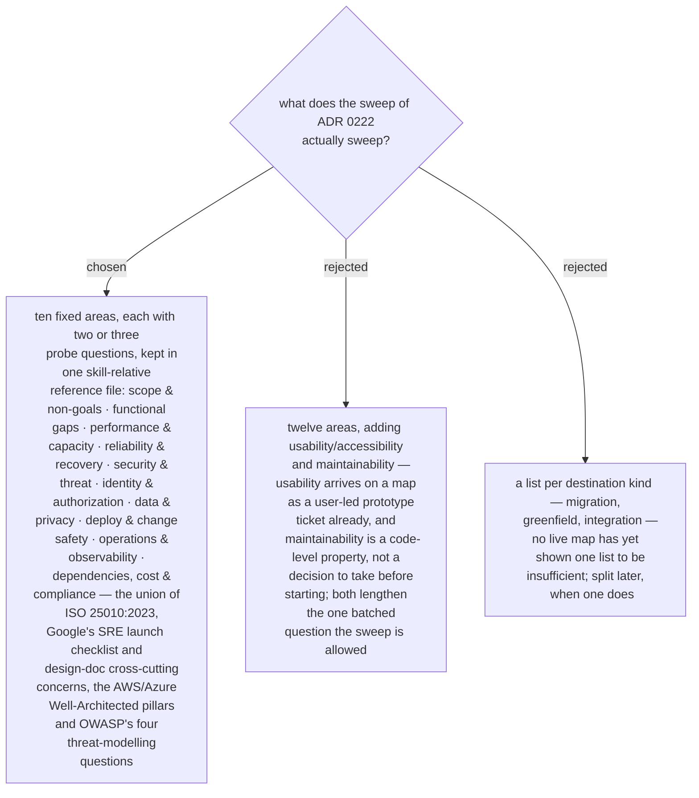

# The frontier sweep list is ten fixed areas drawn from published frameworks, without usability or maintainability, and one list for every destination

The sweep needs a list, and the list is where the user's original complaint lives:
non-functional, functional, security, RBAC, backup and rollback, deployment limits.
Those six map onto four of the ten areas above; the other six — scope and
non-goals, data and privacy, operations, dependencies, cost, compliance — are what
every surveyed framework asks and the complaint did not name, which is the argument
for a fixed list over the user's own memory. The list lives in a reference file
beside chart-map's SKILL.md, addressed skill-relatively, and each area carries two
or three probe questions phrased in the user's terms so the batched sweep question
can quote them. Usability and maintainability are left out on purpose, and the
list is one list; both are recorded here as the places to reopen first if a real
map shows the sweep missing something.
