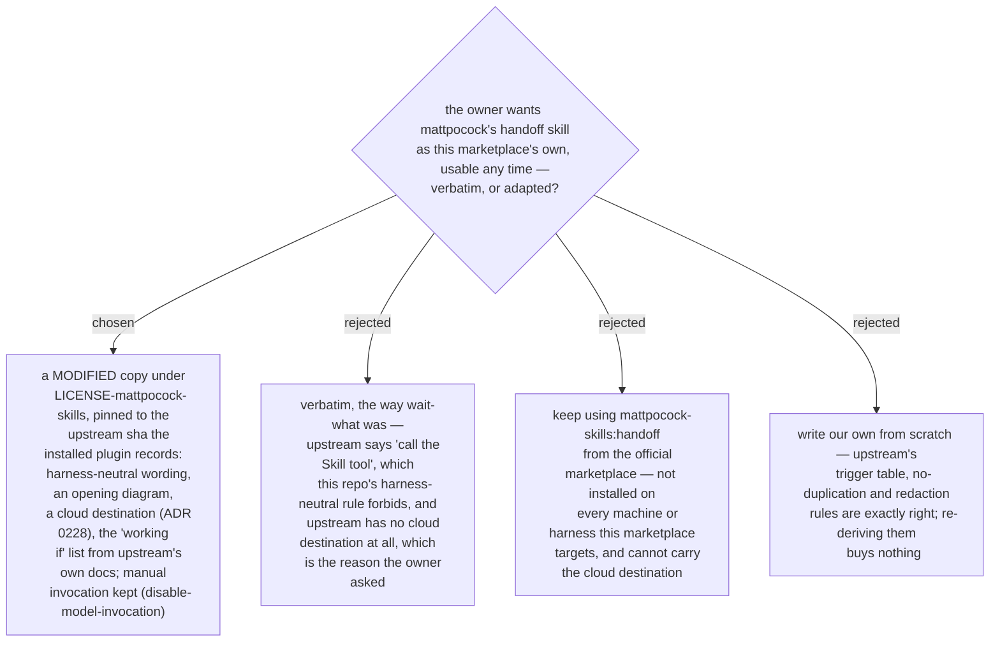

# `handoff` is vendored from mattpocock/skills as a MODIFIED copy, not verbatim like `wait-what`

The owner asked for mattpocock's `handoff` as a skill of this marketplace, to use
at any phase boundary and specifically to hand a written plan to a Claude Code
cloud session. Upstream's copy is small and right about the core — portability
not compression, suggested skills, reference-don't-copy, redact — but it names
one harness's tool and knows nothing about cloud sessions, so a verbatim copy
would break this repo's harness-neutral rule and miss the requested case. It is
therefore vendored as a **modified** copy: the licence file lists the changes and
the upstream sha (`6654f6b60cd9…`, the commit the installed 1.2.3 plugin pins),
`generate_skills_tree.py` carries the licence into the generated tree the way
it does for `wait-what` (ADR 0158), and `disable-model-invocation: true` is kept
— a handoff is something the user asks for, never something the agent decides.
