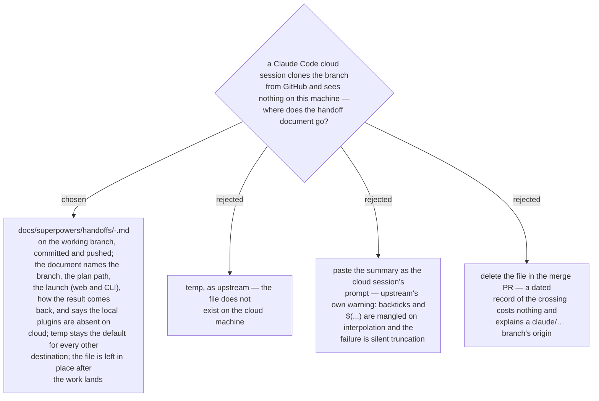

# The `cloud` destination commits and pushes the handoff into the repo; every other destination stays in temp

Upstream `handoff` writes to the OS temp directory on purpose: a handoff is a
transit document, not an artifact. That holds for every destination except one.
A Claude Code cloud session is created from a GitHub branch; it has no access to
this machine, its temp directory, its marketplaces or its user-scope plugins.
The only channel into it is the branch itself, so for the `cloud` destination
the document is written into the repo under `docs/superpowers/handoffs/`,
committed, and pushed on the working branch — never on `main` — after anything
it points at (spec, plan, ADRs) has been committed too. Because the plugins are
absent there, the document must stand on its own and say so: it names the plan
path, states that the plan is self-contained, and does not promise a review loop
that depends on a skill the cloud session cannot load. The launch is given both
ways (the web *Create session* route and `claude --cloud "Read <path> and
continue from it."`), pointing at the file rather than pasting it, and the return
path is named (`claude --teleport`, or fetch and check out the `claude/…`
branch) together with what must be re-verified locally before merge. The file
stays after the work lands.
