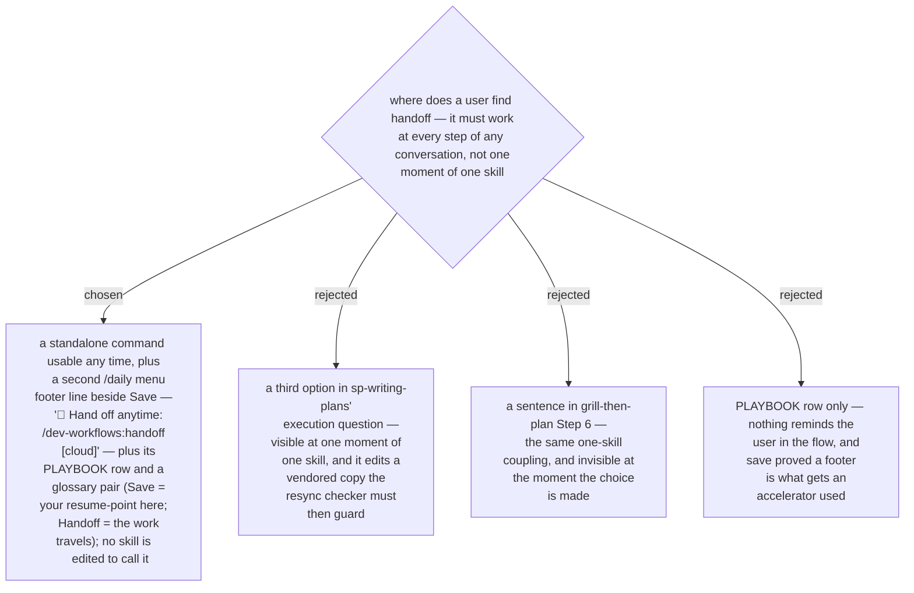

# `handoff` is reachable at any moment — a `/daily` footer beside Save, not a hook inside one skill

The first draft of this decision wired `handoff` into the plan's execution
question (the moment it was missing on 2026-09-14). The owner rejected that
shape: a handoff has to be possible at every step of a conversation with the
agent — mid-debug, mid-grill, mid-review — not at one moment of one skill. The
repo already has an accelerator with exactly that property: `/daily save`, a
footer line on the station menu that is not a station (ADR 0004) and captures
the user's own resume-point in this repo. `handoff` is its twin for the case
where the *work* travels — to another harness, machine, colleague or a Claude
Code cloud session — so it takes the same shape: a standalone command
(`/dev-workflows:handoff [cloud] <what the next session is for>`) invocable at
any time, a second footer line on the `/daily` menu beside Save, one PLAYBOOK
row, and a glossary entry that states the Save / Handoff distinction so nobody
reaches for the wrong one. No skill is edited to call it, and `sp-writing-plans`
stays as upstream shipped it; the circle stays five stations — two footers are
still footers.
