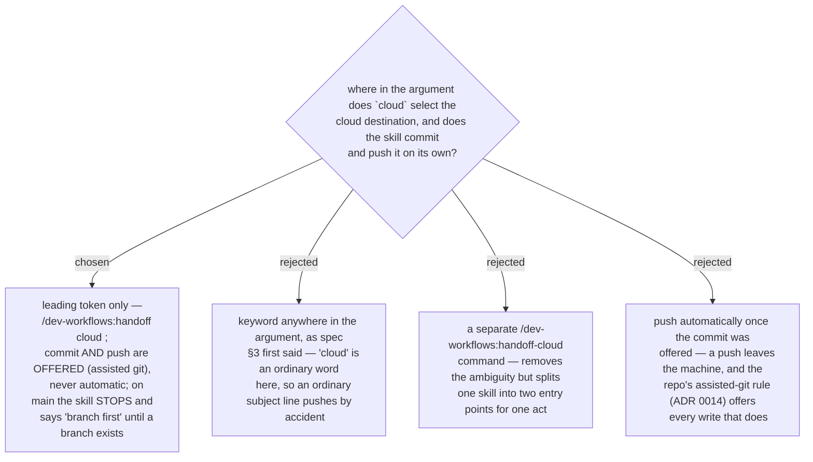

# The `cloud` keyword is the leading token, and the push is offered, never automatic

This ruling came out of the final whole-branch review of the `handoff` branch
(2026-09-14). The drafted skill and its spec (§3 item 1) said the word `cloud`
"anywhere in the arguments" selects the cloud destination. In this repo `cloud`
is an ordinary word — "cloud portal", "cloud flows" — and the cloud path
commits and pushes, so an ordinary subject line containing it would silently
select a push. The fix scopes the trigger to the argument's first token, the
same shape as any other flag-like leading word, so `/dev-workflows:handoff
cloud <what next>` selects it and `/dev-workflows:handoff fix the cloud flows
config` does not.

The same review found the drafted §4 steps 1–2 treated the commit as offered
but the push as automatic once a branch existed. ADR 0014 already settled that
a git write in this repo is offered, never run silently; a push is a git write
that leaves the machine, so it gets no exception. The skill now stops outright
when the current branch is `main` — "branch first" — rather than proceeding to
an offer that would only be refused, and once past that, the commit and the
push are each their own yes/no, never chained automatically off one approval.
This ADR amends the spec and ADR 0228's step-by-step description accordingly;
it does not reopen ADR 0228's choice of destination or ADR 0227's choice to
vendor the skill.
