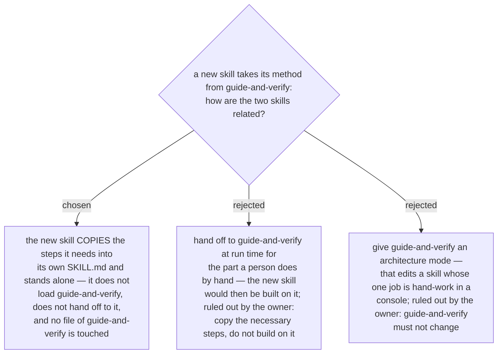

# The architecture-document skill copies the guide-and-verify steps it needs — it never loads it, and guide-and-verify is not edited

A new skill is being designed whose output is the architecture document — with its
diagrams — for a new system that plugs into an existing one (named
`architect-and-verify` by ADR 0246). Its method comes from
`guide-and-verify`: measure the live system before writing, state the expected result
before anyone acts, check afterwards. Ruled by the owner 2026-10-03: the new skill only
copies the necessary steps from `guide-and-verify` and is not built on it, and
`guide-and-verify` must not change.

So the new skill carries its own text for every step it borrows, adapted to its own
domain, and has no run-time dependency on `guide-and-verify` — it never loads it and
never hands off to it. The accepted cost is drift: from the day of the copy the two are
separate texts, and a later change to `guide-and-verify` does not reach the new skill.
Which steps count as necessary is recorded separately, as it is decided.
