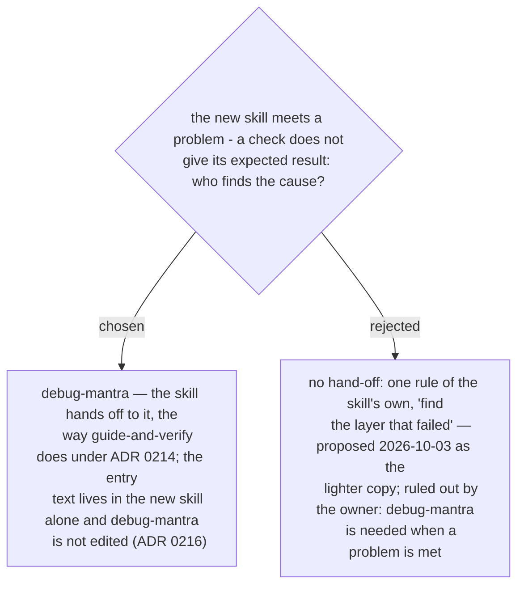

# The architecture-document skill hands a problem to debug-mantra — it does not diagnose by a rule of its own

When the steps to copy from `guide-and-verify` were first listed (ADR 0231), the
`debug-mantra` hand-off was left off the list and one rule stood in its place: when a
connectivity test fails, find the layer that failed. Ruled by the owner 2026-10-03:
`debug-mantra` is needed when the skill meets a problem.

A failed test here is the moment ADR 0214 describes — something misbehaved and a person
is about to act on a guess, such as a second firewall request or a reinstall. A list of
layers is a set of hypotheses, not a method: it has no reproduction, no disproof and no
ledger, which are what `debug-mantra` supplies. The hand-off goes to `debug-mantra`
directly, never through `guide-and-verify` (ADR 0231), and following ADR 0216 its entry
conditions live in the new skill's own SKILL.md. Still open, each its own decision:
which moments count as a problem, and what the skill already holds for each of the four
steps when the mantra opens.
