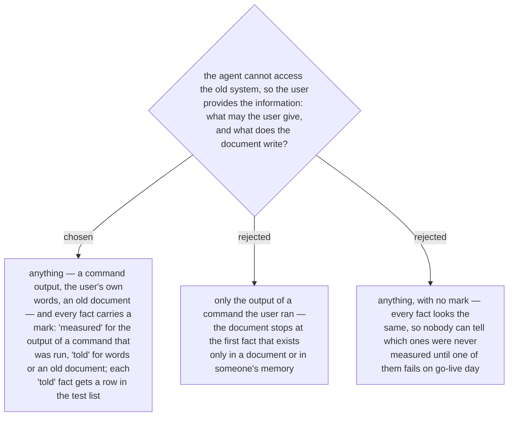

# A fact the user provides carries a mark — measured or told — and every told fact gets a test row

Ruled by the owner 2026-10-03: when the agent cannot access the old system, the user
must provide the information. Asked what form that takes, the owner chose the marked
form. The example that carried it: an old network diagram says port 1433 is open from
the application server to the database server. Written with no mark, the document says
"open", the connection fails on go-live day, and nobody can say whether the diagram was
wrong or the firewall changed. Marked `told`, the same fact puts a row for port 1433 in
the test list, so it is tested before that day.

This is the new skill's own copy (ADR 0231) of the two honest options `guide-and-verify`
gives for a system the agent cannot read — borrow the person's eyes, or declare the
baseline unverified — turned from a label on the baseline into a mark on each fact.
