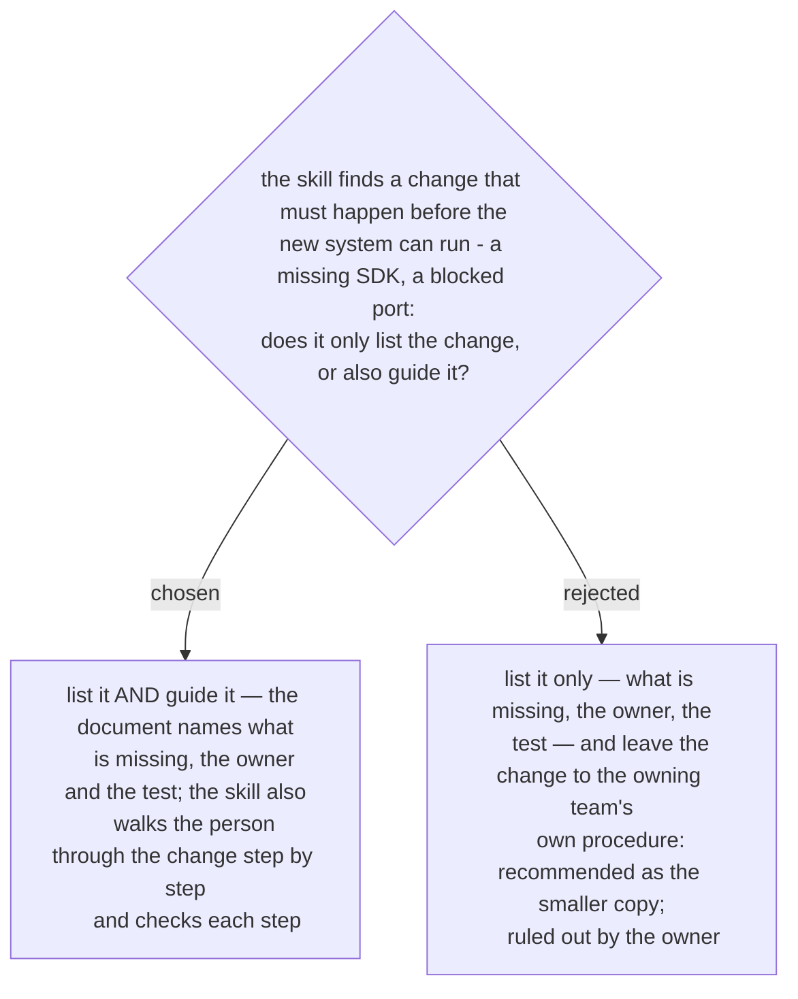

# The architecture-document skill guides each change step by step — it does not only list it

Asked 2026-10-03 with a worked example — the SDK is missing on a server. Listing only
would put the change, its owner and its test in the document and leave the change to the
team that owns the server. That was the recommended option, because firewalls and
servers usually belong to other teams with their own procedures, and because guiding a
change is the work `guide-and-verify` already does. The owner chose the other one: the
skill lists the change and also guides the person through it step by step, and checks
each step.

The consequence lands on ADR 0231: the copy grows. The steps that guide a change — the
fixed step shape, one action per line, the before-state snapshot, the apply step as its
own line, the after-check in a second channel — are now necessary and are copied into
the new skill. The first list of steps to copy had the before-state snapshot as not
needed; that no longer holds. `guide-and-verify` is still neither loaded nor edited.
