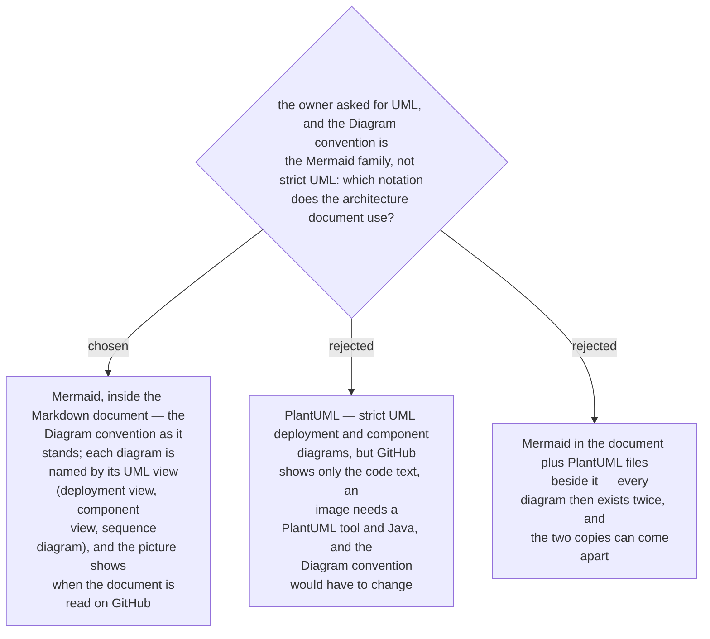

# The architecture-document skill draws its UML views in Mermaid — the Diagram convention does not change

The owner's request named UML. The glossary's **Diagram convention** entry says the
convention is the Mermaid family and warns against calling it a UML rule. Asked
2026-10-03 which one this skill uses — with the example of a network team that opens the
document on GitHub to see which ports to open — the owner chose Mermaid.

So "UML" in this skill names the *view*, not the notation: deployment view, component
view, sequence diagram. The deployment view is boxes for zones and servers, with one
arrow per connection that carries its port. Mermaid has no strict UML deployment or
component diagram, and that is accepted. Which views the document carries is its own
decision.
