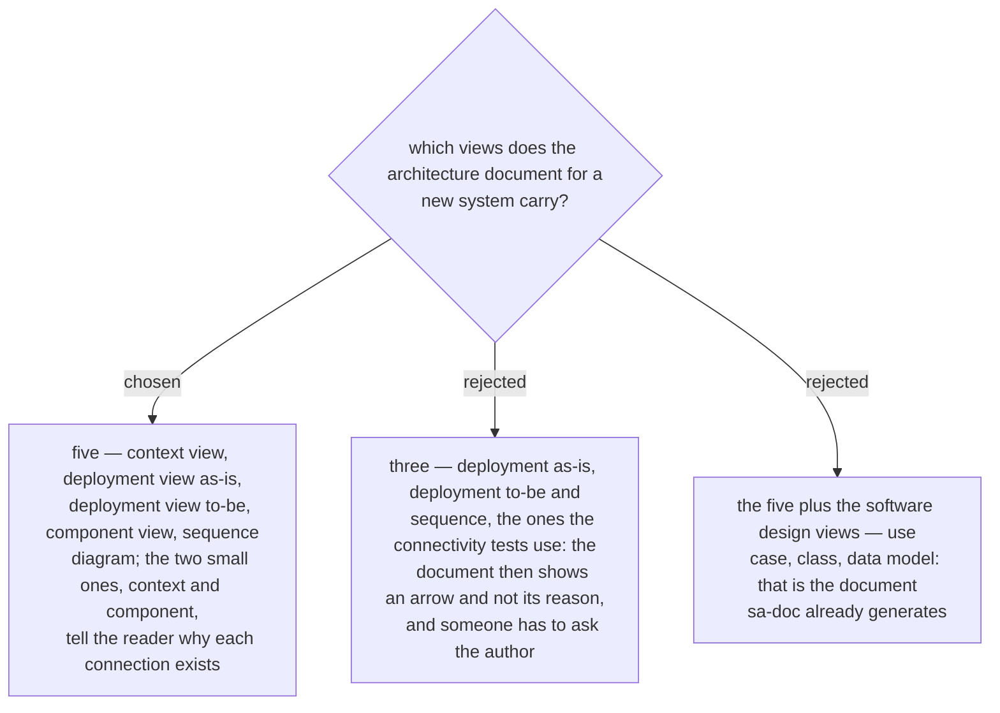

# The architecture document carries five views — context, deployment as-is, deployment to-be, component, sequence

Asked 2026-10-03 with an example: the network team asks why server APP01 connects to
server DB02 on port 1433. With the component view the document answers — the order
module reads the customer table; without it the document shows only the arrow. The
owner chose all five.

Each view is a Mermaid diagram named by its UML view (ADR 0235). The context view shows
the new system, the old system, the users and the other systems around them. The
deployment view as-is shows the old system's servers, zones and firewalls today. The
deployment view to-be is the same picture with the new parts: one arrow, with its port,
per connection, and a mark on each new part. The component view shows the software
parts and the points where the new system connects to the old one. A sequence diagram
follows one flow across the connections, step by step. The software design views stay
with `sa-doc`.
