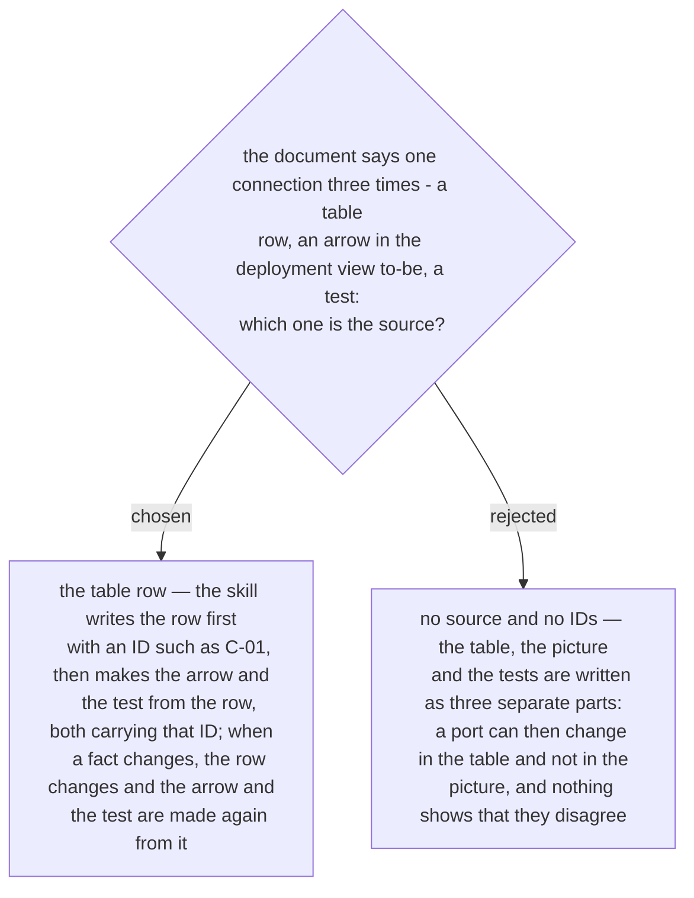

# A connection-table row is the source — its arrow and its test are made from it and carry its ID

The question did not land when it was first asked in the abstract. It was posed again
2026-10-03 with a three-part sample of the document — a connection table with rows
`C-01` and `C-02`, a deployment view to-be with one arrow per row, and one test per row
— and the owner chose the row as the source.

Each row carries the ID, the two ends, the port, the reason for the connection and its
mark (ADR 0233). The deployment view to-be has exactly one arrow per row and the test
list has one test per row, each labelled with the row's ID, so a reader can go from an
arrow to its reason and to its test. A change to a connection is made in the row and
nowhere else; the arrow and the test are made again from it. This is the lesson `sa-doc`
rests on (ADR 0025), at the size of one table: parts that are written separately end up
contradicting each other.
