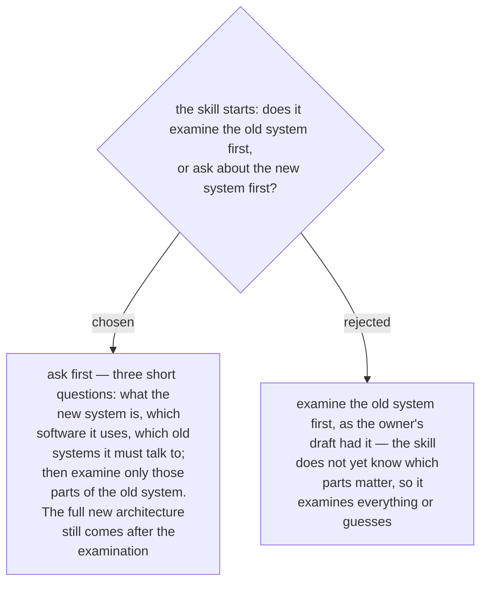

# The architecture-document skill asks three questions about the new system before it examines the old one
> **Refined by ADR 0260 (2026-10-03):** a start question the user has already answered is not asked again — the answers given become the document's first section. The order decided here is unchanged.

The owner's draft had three steps: check the existing system, look at the firewall, then
ask for the new architecture. Asked 2026-10-03 with an example — an old environment of
40 servers and a new web application that talks to two of them, the ERP database and the
login server — the owner moved a short version of the third step to the front.

The skill opens with three questions about the new system, and the answers set the scope
of the examination: two servers, not forty. The draft's third step is not removed. The
full new architecture, and how it plugs into the old system, is still taken after the
examination, when the facts it has to fit are on the page.
