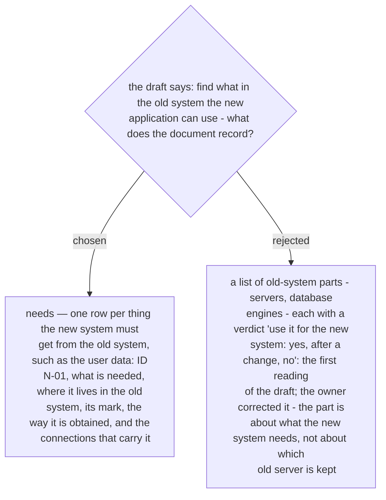

# What the draft calls reuse is a need — one row per thing the new system must get from the old system
> **Refined by ADR 0259 (2026-10-03):** a connection that serves no need of the old system — users reaching the new system — holds a dash and its reason in the Need column; "every connection row names the need it serves" holds for the rest.

The owner's draft step reads: check the existing system, and what in it we can use for
the new application. It was first read as a reuse verdict on infrastructure, and a
sample table of old-system parts — a database server, a login server, a web server —
each with a yes/no verdict was put to the owner on 2026-10-03. The owner corrected the
reading: the part means, for example, that the new system must use the user data held in
the old system.

So the document carries a needs table. A row is one need: what the new system must get
(the user data: name, email, department), where that lives in the old system (a fact
with its mark, ADR 0233), the way the new system obtains it, and the IDs of the
connection-table rows that carry it. The link runs both ways: every connection row names
the need it serves, which is the reason column ADR 0237 gave it. For each need the skill
does four things in order — find where the thing lives, settle how it is obtained, write
the connection rows and the changes that follow (an account, a permission, a firewall
rule), and test it.
