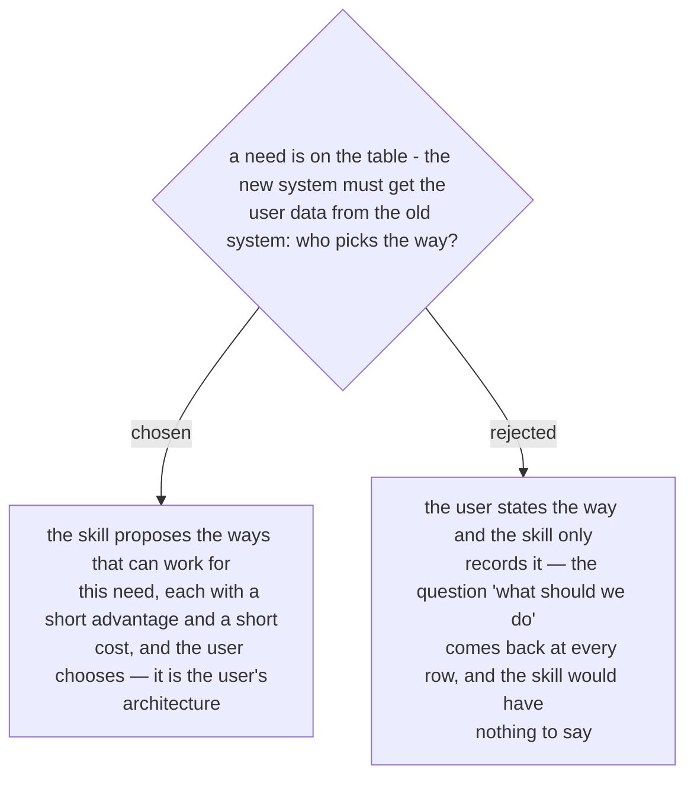

# The skill proposes the ways to meet a need, and the owner of the architecture chooses

Asked 2026-10-03, right after the owner's own question about the user-data need: what
should we do? The sample put four common ways next to that need. Call the old system's
API — the data is always current, but the old system must have an API. Read the old
database directly — quick to build, but a table change in the old system breaks the new
one. Copy the data to the new system on a schedule — the old system carries load only
during the copy, but the data lags. Share the login system, such as LDAP — no second
copy of the passwords, but it covers login and basic account data only.

The owner chose to have the skill propose and the user decide. The skill does not pick
the way itself: the choice is an architecture decision, and it belongs to the person who
owns the architecture (ADR 0239 has the row the choice is written into).
