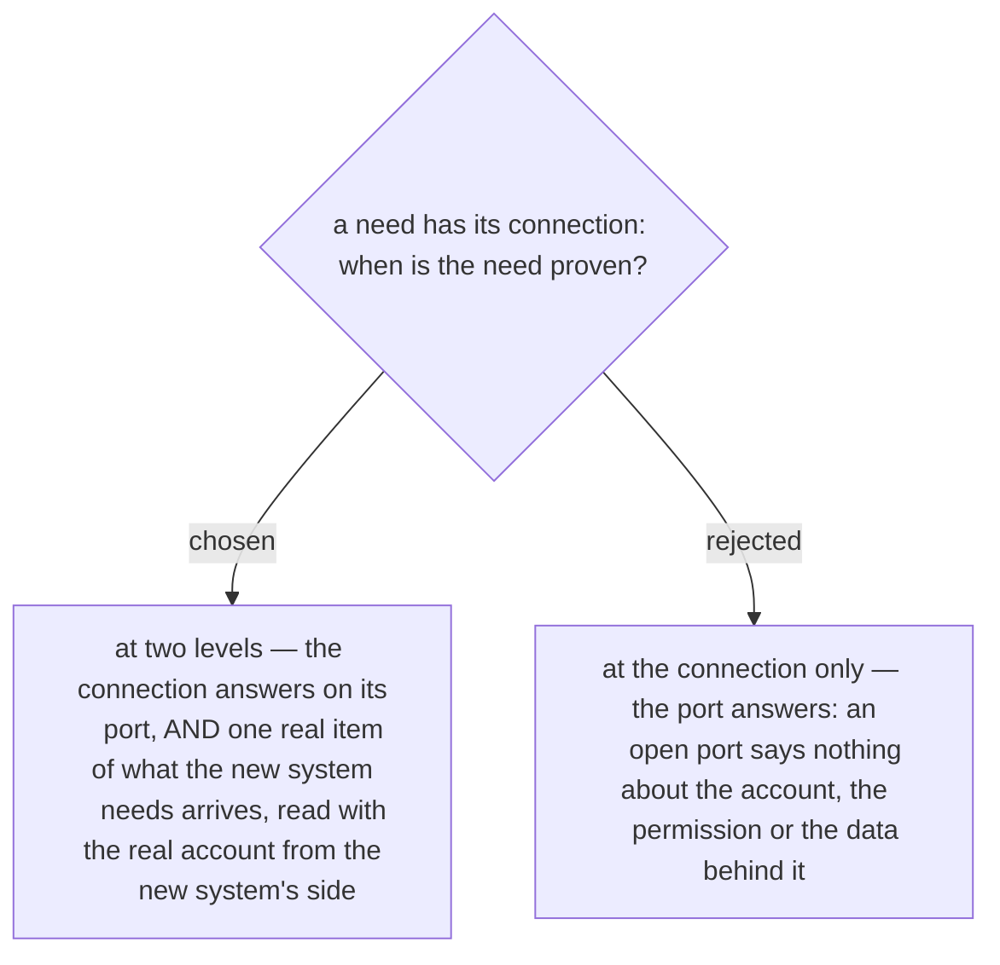

# A need is tested until the data arrives — a port that answers is not the test

Part of the needs-table proposal the owner accepted 2026-10-03 (ADR 0239). The earlier
sample of the document tested a connection by its port alone. A need is not a port: the
user data can be out of reach behind an open port because the account does not exist,
has no permission, or reads an empty view.

So every need carries a second test beside its connection tests. One real item of what
is needed — one user record — is read with the real account, from the new system's
server, by the new system or by a person acting for it before it is installed. The need
is proven only when both levels pass.
