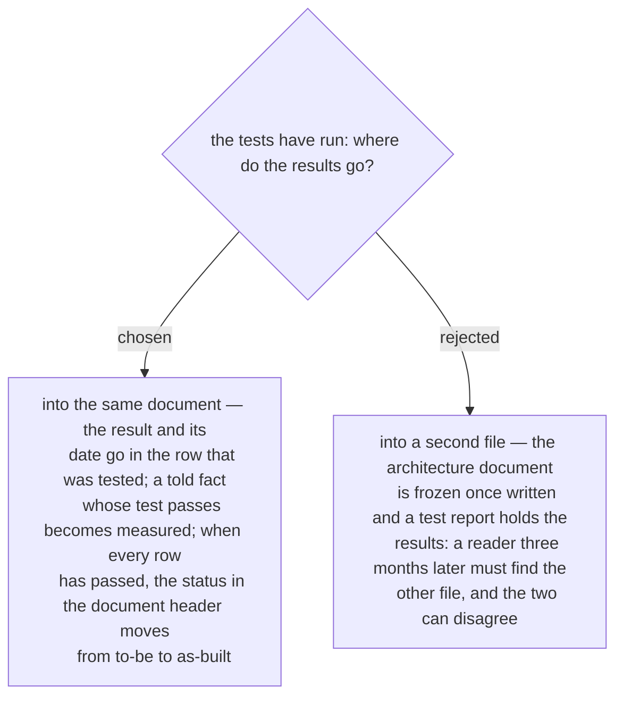

# A test result is written into the row it tests — one document, whose status moves from to-be to as-built

Asked 2026-10-03 with a sample header — system, environment, status — and one connection
row carrying its expected result, its real result and the date. The example that carried
it: three months later someone opens the document to see whether port 1433 is really
open. In one document the answer is in row `C-01`, passed on its date; with a separate
report the reader has to find a second file that may not agree with the first.

So the architecture document is a living record, not a design that is filed once. Every
row has an expected result before anyone acts and a real result afterwards. The mark
follows the evidence (ADR 0233): a told fact becomes measured when its test passes. The
header says to-be while any row is still open and as-built once every row has passed,
with the count and the date.
