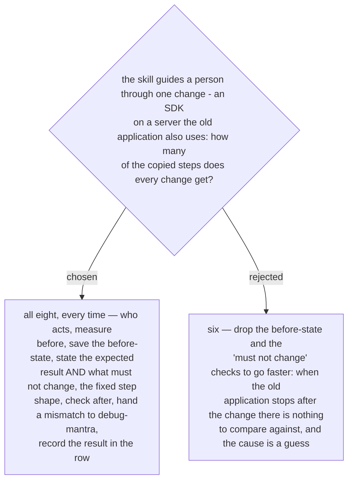

# Every change runs the same eight steps — including the before-state and what must not change

ADR 0231 says the new skill copies the `guide-and-verify` steps it needs, and ADR 0234
made guiding a change part of the skill. Asked 2026-10-03 which steps every change gets,
with the example of an SDK installed on a server the old application also uses, the
owner chose all eight:

1. **Who acts.** The skill reads and tests; the person makes the change.
2. **Measure before.** Run the read-only check and record the result in the row.
3. **Save the before-state** of what the change touches — the installed software, the
   state of the old application's services.
4. **State the expected result, and what must not change** — the old application's
   services still run.
5. **Give the steps one at a time** in the fixed shape: Go to / Do / Do not / How to
   verify yourself / Then report.
6. **Check after.** Measure again, compare before with after, and check what must not
   change.
7. **A mismatch stops the work.** No redo; the skill hands off to `debug-mantra`
   (ADR 0232).
8. **Record the result**, with its date and time, in the row.

Steps 3, 4 and 6 carry the cost the shorter option wanted to save, and they are the ones
that answer the example: the old application does not start after the SDK is installed,
and the before-state is the only thing that says what changed.
