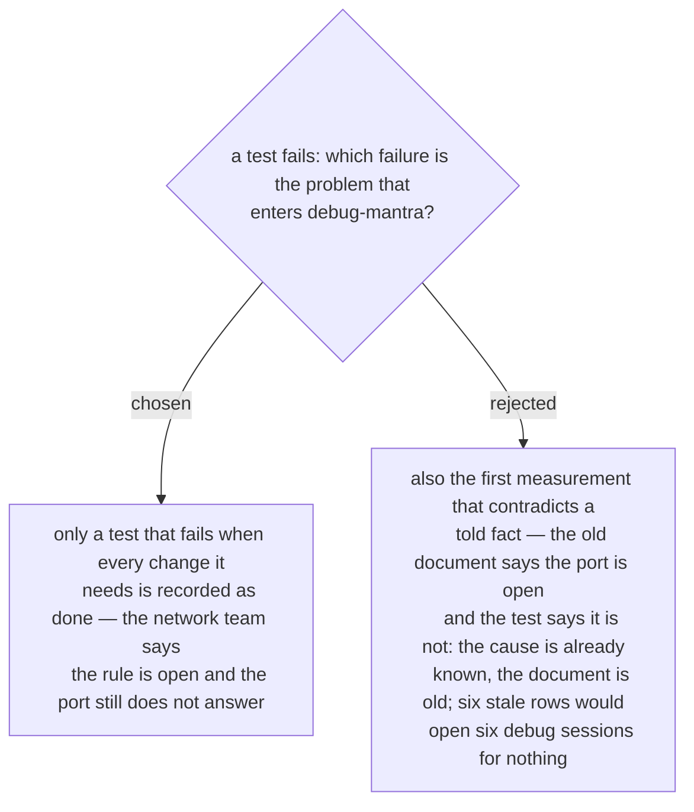

# A problem is a test that fails after everything it needs is done — a told fact that turns out wrong is a finding

ADR 0232 says the skill hands a problem to `debug-mantra` and left open which moments
count. Asked 2026-10-03 with two moments at which a test of port 1433 can fail, and with
the example of a five-year-old document that is wrong in 6 rows of 20, the owner chose
the narrow reading.

A told fact that its first measurement contradicts is a finding, not a problem. The
skill writes the measured value into the row and adds the change that follows — a
firewall request — and the work goes on. A problem is the other moment: everything the
row needs is recorded as done, and the test still fails. Only then does the skill stop
and hand off. This is the line ADR 0214 drew for `guide-and-verify` — a baseline that
contradicts the document is the expected case; a failed after-check is the malfunction —
copied into the new skill (ADR 0231).
