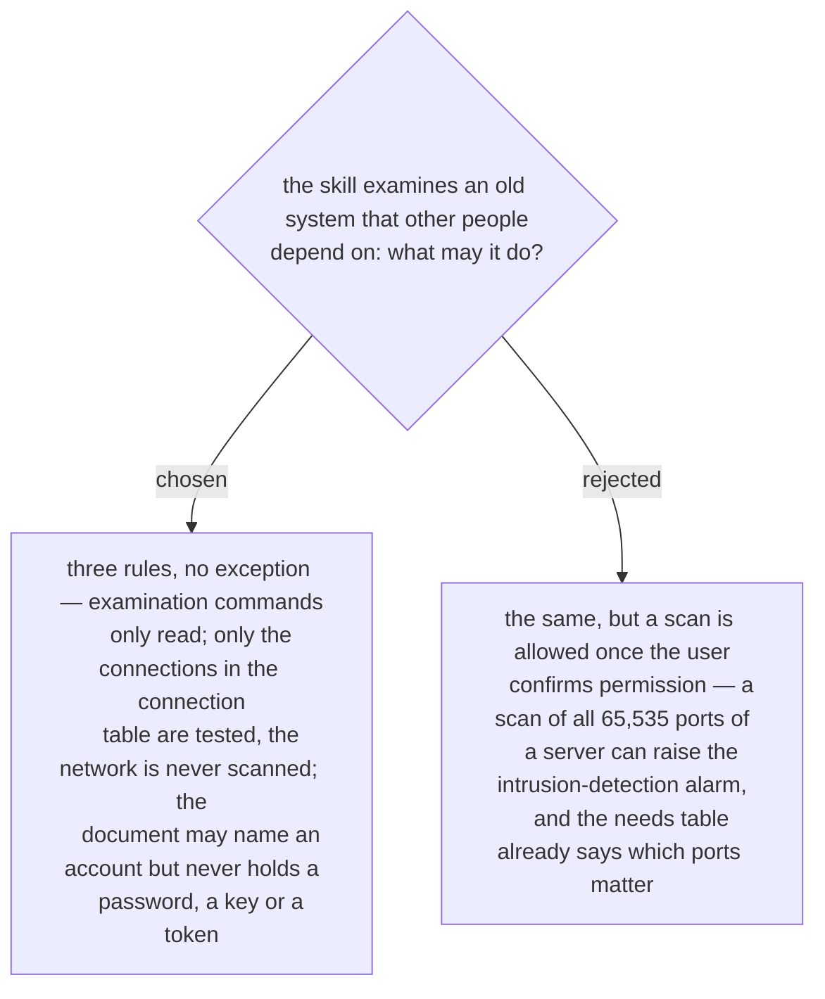

# The skill examines read-only, tests only the connections in the table, and never writes a secret

Asked 2026-10-03 with an example: the skill wants to know which ports server DB02 has
open. Under the three rules it tests port 1433 only, because row `C-01` names it. With
the exception it would scan every port of the server, the company's intrusion detection
may alert, and the security team comes asking. The owner chose the three rules with no
exception.

The second rule costs nothing the skill needs. Every connection it has a reason to test
is a row that serves a need (ADR 0239), so a port outside the table is a port no need
asked for. The third rule holds for everything the skill writes — the document, a step,
a recorded result: an account is named, its secret is not.
