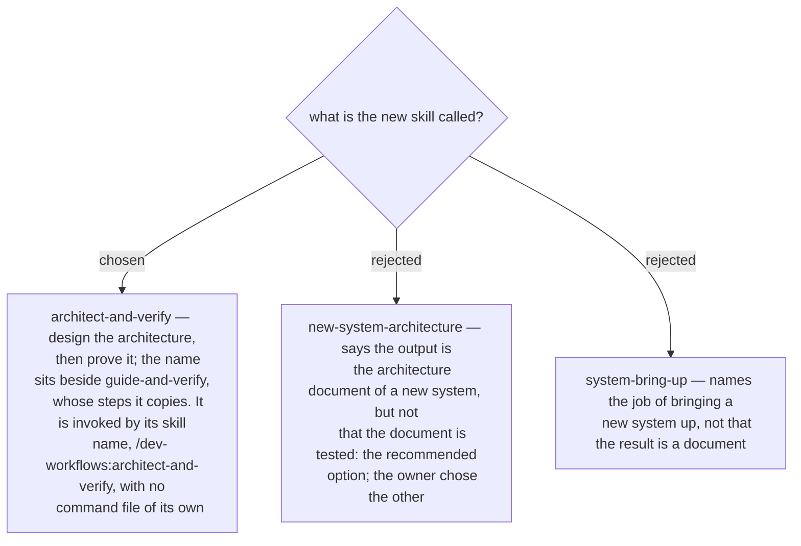

# The skill is named architect-and-verify

Asked 2026-10-03 with three names. `new-system-architecture` was recommended as the name
that says what you get; its weakness was that it says nothing of the testing.
`architect-and-verify` says both halves — the architecture, and the proof — and its
stated weakness was that it reads close to `guide-and-verify` and could be invoked by
mistake for it. The owner chose `architect-and-verify`.

The closeness is real, so the Playbook row and the skill's description have to keep the
two apart: `guide-and-verify` is for one hand-made change in a console;
`architect-and-verify` is for a new system that must join an old one, and it ends in an
architecture document. The skill gets no command wrapper — like `guide-and-verify`, it
is invoked by its skill name. The earlier ADRs of this design (0231–0245) call it "the
architecture-document skill" or "the new skill"; they are not renamed.
