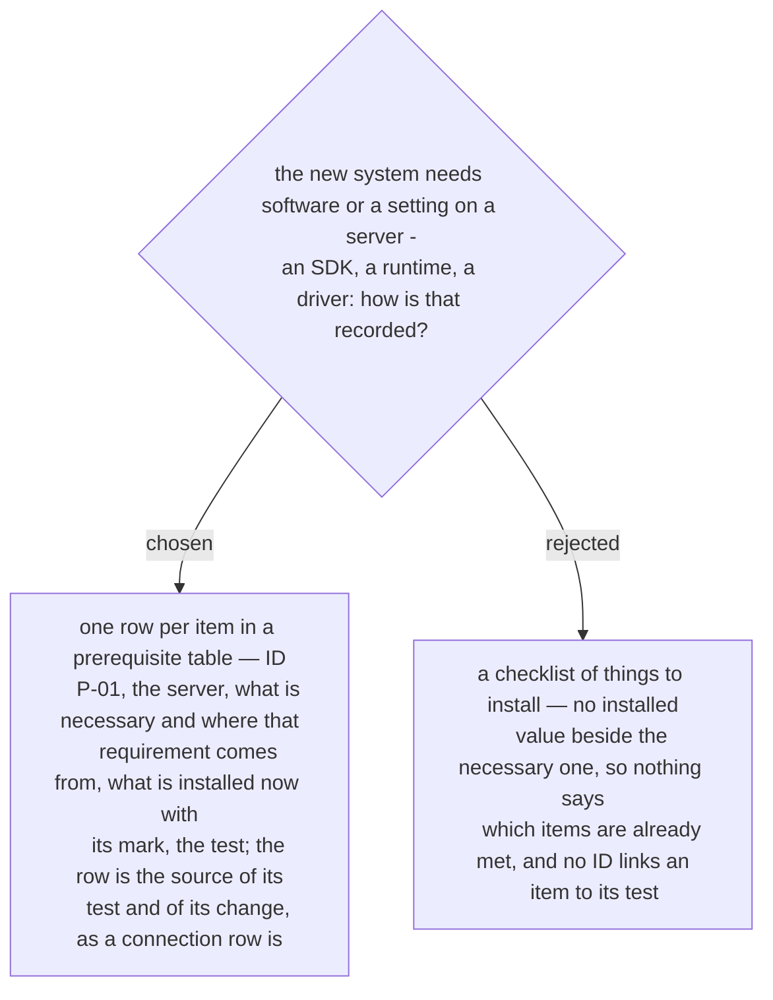

# A prerequisite-table row is the source of its test and its change

Confirmed by the owner in the recap of 2026-10-03, as the first of five defaults. The
connection table (ADR 0237) made a row the source of an arrow and a test; the
prerequisite table applies the same rule to what a server must have before the new
system can run.

A row carries the ID (`P-01`), the server, what is necessary and the source of that
requirement, what is installed now — a fact with its mark (ADR 0233) — and the test that
reads the installed value. When the installed value is not what is necessary, the row
gives rise to a change (ADR 0234), and the result of the test is written back into the
row (ADR 0242).
