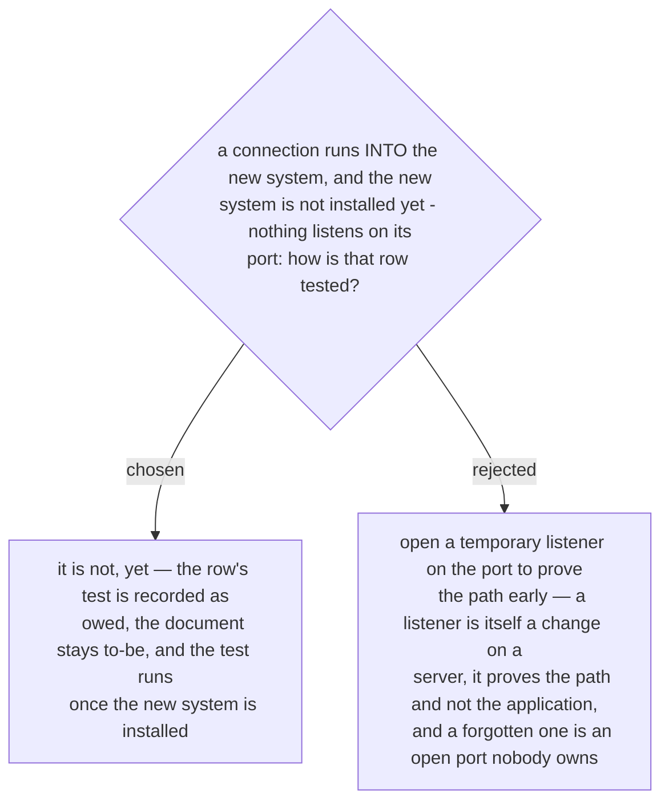

# A connection into the new system stays owed until the system is installed — no temporary listener

Confirmed by the owner in the recap of 2026-10-03, as the second of five defaults.
Before the new system is installed, a test of a connection into it cannot pass, for a
reason that is not a fault: nothing listens. That is not a problem in the sense of
ADR 0244 either — the row still needs something that is not done.

So the row carries its test as owed, with the reason. The document cannot become
as-built (ADR 0242) until that test has run and passed.
