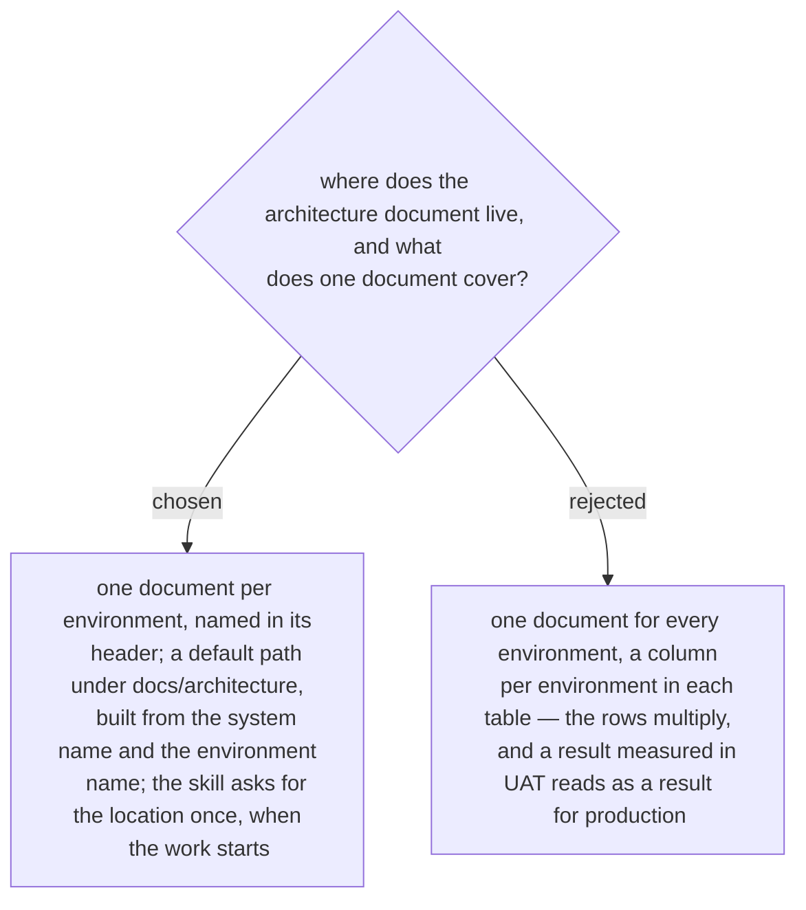

# One architecture document per environment, saved where the user says at the start

Confirmed by the owner in the recap of 2026-10-03, as the third of five defaults. Facts
differ by environment — the servers, the addresses, the firewall rules — and so do
results: a port that answers in UAT says nothing about production.

So one document describes one environment and says which in its header, beside the
status (ADR 0242). A second environment is a second document. The default path is
`docs/architecture/<system>-<environment>.md` in the project the skill is run in; the
skill asks once, at the start, and writes where the user says.
