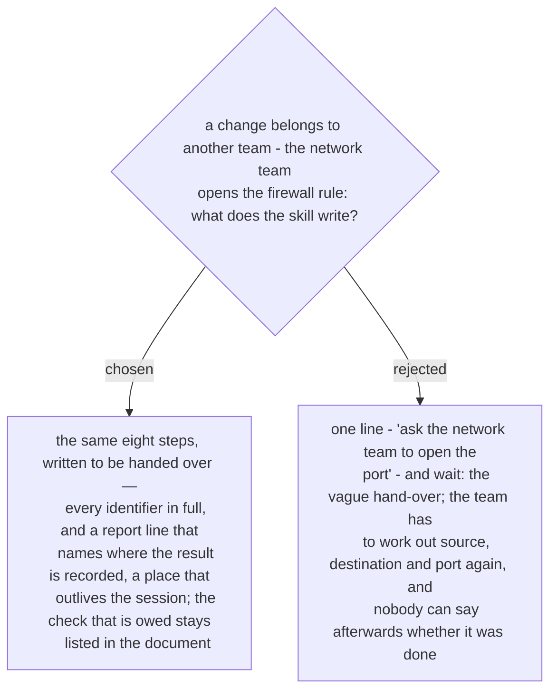

# A change that belongs to another team is written so that team can follow it alone

Confirmed by the owner in the recap of 2026-10-03, as the fourth of five defaults.
ADR 0234 has the skill guide each change, and ADR 0243 gives every change the same eight
steps. But the person who makes the change is often not the person in the session, and
the change may land days later.

The steps of such a change are written for a reader who has only the document: source,
destination, port and rule named in full, nothing that points back at the session, and a
report line aimed at a destination that will still be there — the row, a ticket. The
after-check of that change is recorded as owed until someone runs it. This is the new
skill's copy (ADR 0231) of two `guide-and-verify` rules: aim the report line at whoever
will actually be there, and when the whole thing is deferred, the runbook is the
deliverable.
